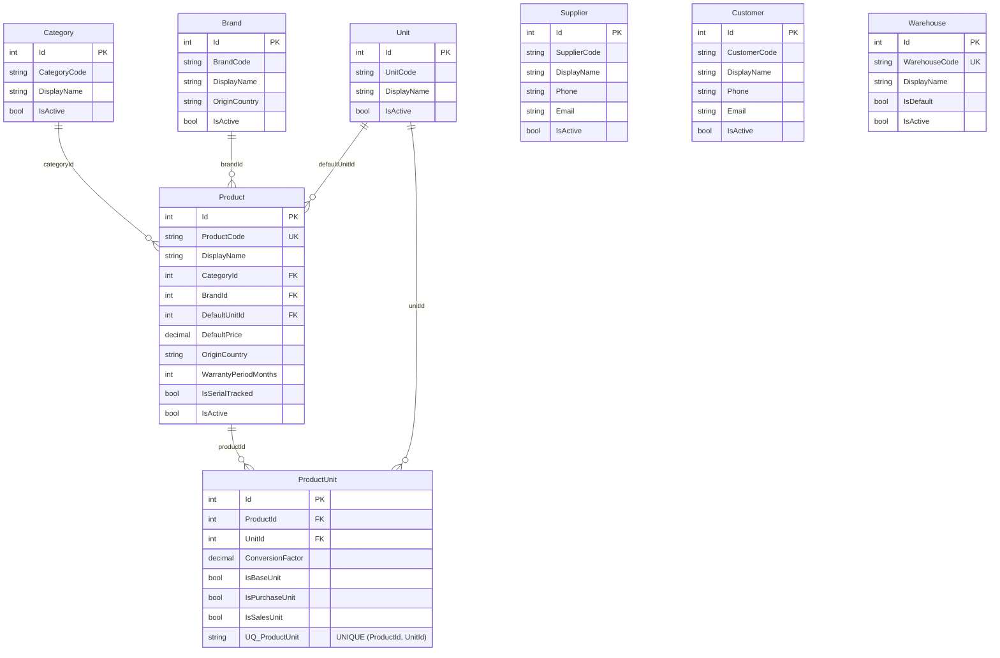
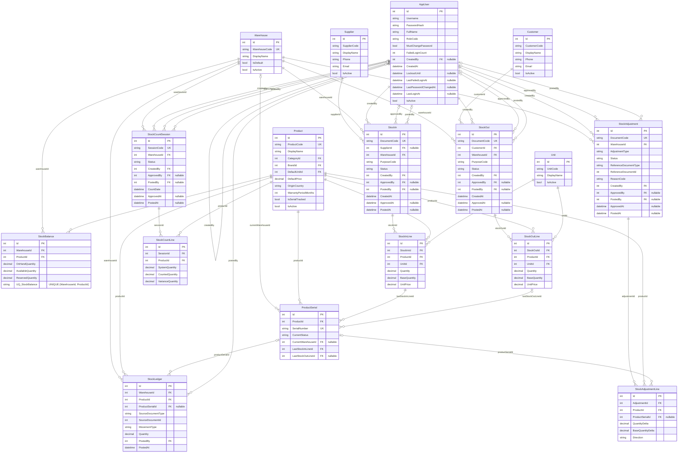
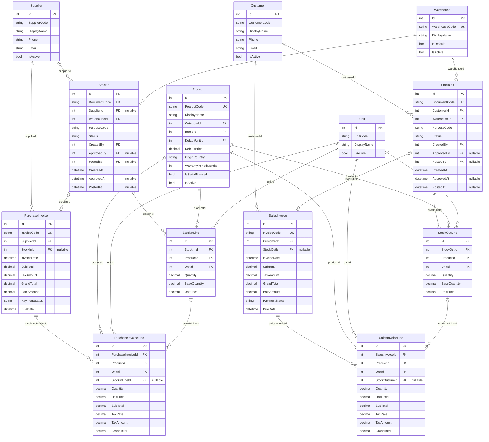
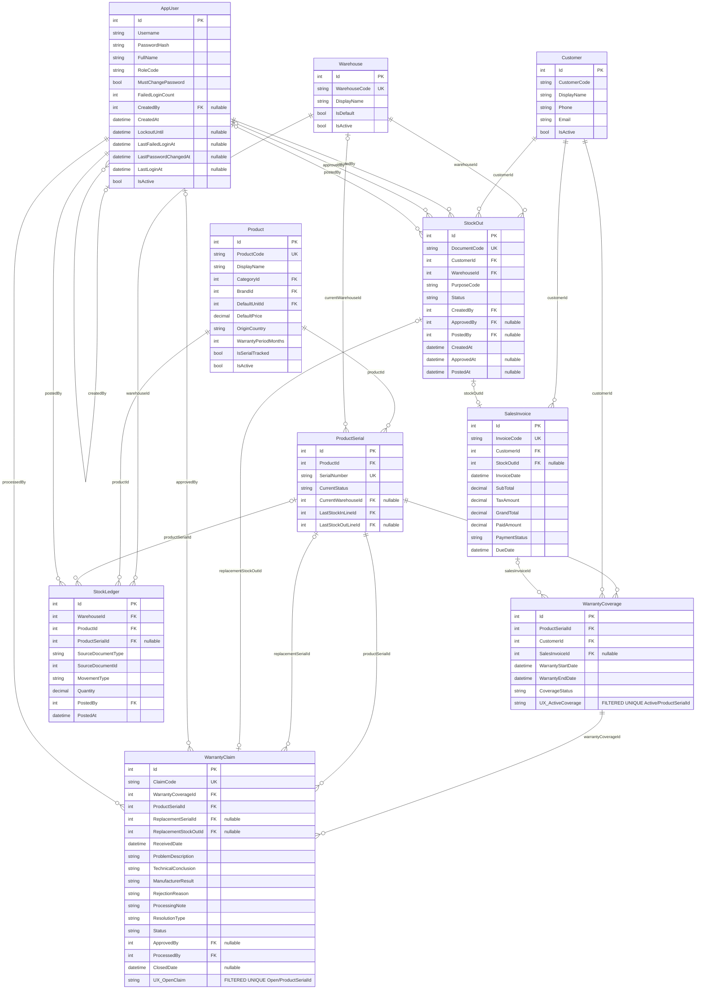
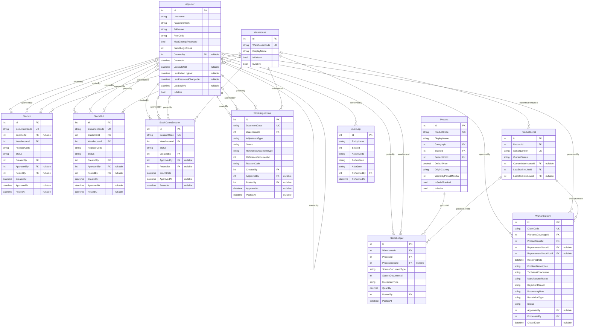

# ERD module

Ghi chú:
- Bộ sơ đồ này được tách từ ERD chi tiết để dễ đọc theo từng phân hệ.
- Một số bảng được lặp lại giữa các module để giữ ngữ cảnh đầy đủ trong từng sơ đồ.
- Mỗi bảng trong module vẫn giữ đủ field theo ERD chi tiết hiện hành.
- `Warehouse` được thiết kế future-ready, nhưng phase hiện tại chỉ có một kho mặc định và UI không cho người dùng chọn kho.

---

## Module 1. Core & Catalog

Ghi chú module:
- `Product.ProductCode` phải unique.
- `Warehouse` phase hiện tại chỉ có một dòng mặc định, nhưng vẫn là thực thể thật để tránh phải phá schema khi mở rộng nhiều kho.
- `ProductUnit` cần unique `(ProductId, UnitId)` và mỗi sản phẩm chỉ có một dòng `IsBaseUnit = true`.

---

## Module 2. Inventory Flow

Ghi chú module:
- `StockBalance` phải unique theo `(ProductId, WarehouseId)`.
- Giai đoạn hiện tại luôn dùng kho mặc định khi nhập/xuất/kiểm kê/điều chỉnh.
- `StockIn.PurposeCode` tối thiểu gồm `Purchase` và `OpeningBalance`.
- `StockOut.PurposeCode` tối thiểu gồm `Sale` và `WarrantyReplacement`.
- Các transaction ghi sổ phải khóa `StockBalance` theo thứ tự `ProductId` tăng dần để giảm rủi ro deadlock.

---

## Module 3. Invoicing

Ghi chú module:
- Thuế phase này chỉ lưu `SubTotal`, `TaxRate`, `TaxAmount`, `GrandTotal` để tính tiền và in hóa đơn.
- Không hỗ trợ nghiệp vụ thuế kế toán phức tạp, kê khai thuế hoặc nhiều sắc thuế.
- `PurchaseInvoice.StockInId` và `SalesInvoice.StockOutId` là nullable.

---

## Module 4. Warranty

Ghi chú module:
- `WarrantyCoverage.SalesInvoiceId` nullable vì coverage của serial thay thế không bắt buộc sinh từ hóa đơn bán mới.
- `WarrantyClaim.ReplacementSerialId` và `ReplacementStockOutId` chỉ có ở nhánh đổi mới.
- Đổi mới bảo hành sinh `StockOut` với `PurposeCode = WarrantyReplacement`.

---

## Module 5. User & Audit

Ghi chú module:
- `ApprovedBy`, `PostedBy`, `ApprovedAt`, `PostedAt`, `ClosedDate` là nullable cho đến khi workflow đi tới transition tương ứng.
- `AuditLog` dùng để truy vết thay đổi nghiệp vụ và thay đổi danh mục/cấu hình nhạy cảm.
