# Bộ diagram quản lý hàng hóa và bảo hành

Tài liệu này là phiên bản Mermaid đồng bộ với file PlantUML và nội dung trong `Thiết kế phần mềm.txt`.

Các quyết định đã khóa trong bản này:
- Giữ mô hình vai trò cố định qua `AppUser.RoleCode`.
- Dùng mô hình `future-ready Warehouse + StockBalance + StockLedger`, nhưng phase hiện tại chỉ vận hành trên một kho mặc định ẩn khỏi UI.
- Hỗ trợ nhập tồn đầu kỳ từ `Excel/CSV` bằng `StockIn` loại `OpeningBalance`, không thêm bảng import riêng trong phase này.
- `PurchaseInvoice` và `SalesInvoice` theo dõi công nợ tổng hợp kèm `SubTotal`, `TaxAmount`, `GrandTotal`; chi tiết thương mại nằm ở `PurchaseInvoiceLine` và `SalesInvoiceLine`.
- Phase này chưa có bảng `Payment`.
- Tách rõ `WarrantyCoverage` và `WarrantyClaim`.
- Serial thay thế trong bảo hành kế thừa thời hạn bảo hành còn lại của serial cũ.
- Khi đổi mới thành công, `WarrantyCoverage` của serial cũ phải bị đóng hiệu lực trong cùng transaction trước khi tạo coverage cho serial mới.
- Activity diagram bản Mermaid giữ ở mức business-flow gọn; bản PlantUML là bản có swimlane để soi rõ trách nhiệm giữa actor, UI, ViewModel, service, EF Core và database.

---

## 1. Kiến trúc WPF / MVVM / SQL Server

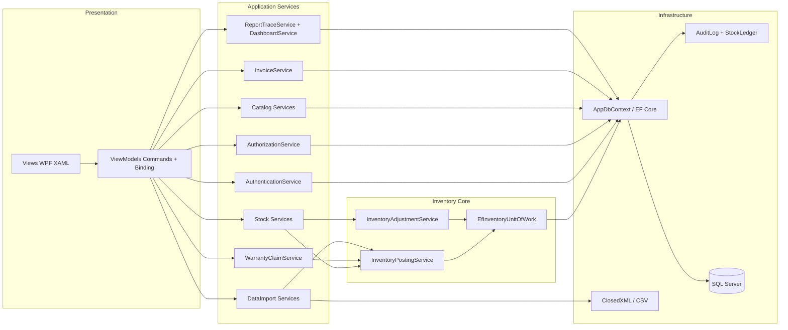
```mermaid
flowchart LR
    subgraph Presentation[Presentation]
        View[Views WPF XAML]
        VM[ViewModels Commands + Binding]
    end

    subgraph Application[Application Services]
        Auth[AuthenticationService]
        Authorization[AuthorizationService]
        Catalog[Catalog Services]
        Inventory[Stock Services]
        Sales[InvoiceService]
        Warranty[WarrantyClaimService]
        Report[ReportTraceService + DashboardService]
        Import[DataImport Services]
    end

    subgraph InventoryCore[Inventory Core]
        Posting[InventoryPostingService]
        Adjustment[InventoryAdjustmentService]
        Uow[EfInventoryUnitOfWork]
    end

    subgraph Infrastructure[Infrastructure]
        Db[AppDbContext / EF Core]
        FileLib[ClosedXML / CSV]
        Audit[AuditLog + StockLedger]
        DB[(SQL Server)]
    end

    View --> VM
    VM --> Auth
    VM --> Authorization
    VM --> Catalog
    VM --> Inventory
    VM --> Sales
    VM --> Warranty
    VM --> Report
    VM --> Import
    Inventory --> Posting
    Inventory --> Adjustment
    Warranty --> Posting
    Import --> Posting
    Posting --> Uow
    Adjustment --> Uow
    Uow --> Db
    Auth --> Db
    Authorization --> Db
    Catalog --> Db
    Sales --> Db
    Report --> Db
    Import --> FileLib
    Db --> Audit
    Db --> DB
```

---

## 2. Use case tổng thể chi tiết

Đường nét đứt ghi nhãn `kế thừa quyền` trong bản Mermaid là quy ước trình bày để người đọc dễ theo dõi phạm vi quyền; đây không phải actor generalization UML chuẩn như bản PlantUML.

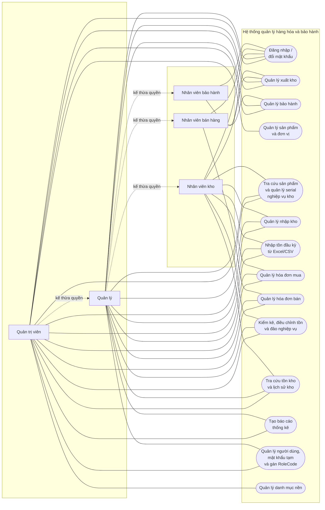
```mermaid
flowchart LR
    subgraph LeftActors[" "]
        direction TB
        Admin["Quản trị viên"]
        Manager["Quản lý"]
    end

    subgraph System["Hệ thống quản lý hàng hóa và bảo hành"]
        direction TB
        UC1(["Đăng nhập /<br/>đổi mật khẩu"])
        UC6(["Quản lý xuất kho"])
        UC10(["Quản lý bảo hành"])
        UC4A(["Quản lý sản phẩm<br/>và đơn vị"])
        UC4B(["Tra cứu sản phẩm<br/>và quản lý serial<br/>nghiệp vụ kho"])
        UC5(["Quản lý nhập kho"])
        UC5A(["Nhập tồn đầu kỳ<br/>từ Excel/CSV"])
        UC7(["Quản lý hóa đơn mua"])
        UC8(["Quản lý hóa đơn bán"])
        UC9(["Kiểm kê, điều chỉnh tồn<br/>và đảo nghiệp vụ"])
        UC11(["Tra cứu tồn kho<br/>và lịch sử kho"])
        UC14(["Tạo báo cáo<br/>thống kê"])
        UC2(["Quản lý người dùng,<br/>mật khẩu tạm<br/>và gán RoleCode"])
        UC3(["Quản lý danh mục nền"])
    end

    subgraph RightActors[" "]
        direction TB
        Storekeeper["Nhân viên kho"]
        Salesman["Nhân viên bán hàng"]
        Technician["Nhân viên bảo hành"]
    end

    Admin -. kế thừa quyền .-> Manager
    Manager -. kế thừa quyền .-> Storekeeper
    Manager -. kế thừa quyền .-> Salesman
    Manager -. kế thừa quyền .-> Technician

    Admin --- UC2
    Admin --- UC3
    Admin --- UC1
    Admin --- UC4A
    Admin --- UC4B
    Admin --- UC5
    Admin --- UC5A
    Admin --- UC6
    Admin --- UC7
    Admin --- UC8
    Admin --- UC9
    Admin --- UC10
    Admin --- UC11
    Admin --- UC14
    Manager --- UC1
    Manager --- UC2
    Manager --- UC4B
    Manager --- UC5
    Manager --- UC5A
    Manager --- UC6
    Manager --- UC7
    Manager --- UC8
    Manager --- UC9
    Manager --- UC10
    Manager --- UC11
    Manager --- UC14

    Storekeeper --- UC1
    Storekeeper --- UC4B
    Storekeeper --- UC5
    Storekeeper --- UC5A
    Storekeeper --- UC6
    Storekeeper --- UC7
    Storekeeper --- UC9
    Storekeeper --- UC11
    Salesman --- UC1
    Salesman --- UC6
    Salesman --- UC8

    Technician --- UC1
    Technician --- UC10
```

---

## 2A. Use case quản trị tài khoản và danh mục

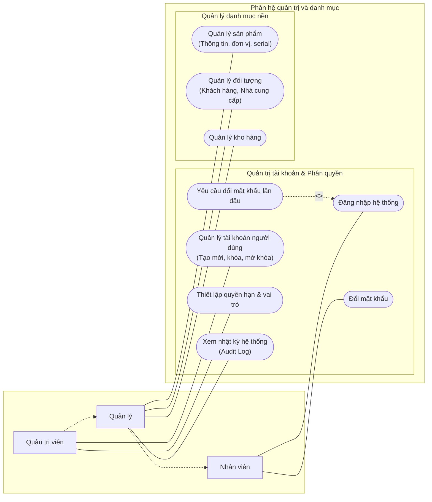
```mermaid
flowchart LR
    subgraph LeftActors[" "]
        direction TB
        Admin["Quản trị viên"]
        Manager["Quản lý"]
        Employee["Nhân viên"]
    end

    subgraph System["Phân hệ quản trị và danh mục"]
        direction TB
        subgraph AdminFlow["Quản trị tài khoản & Phân quyền"]
            UC_Auth1(["Đăng nhập hệ thống"])
            UC_Auth2(["Đổi mật khẩu"])
            UC_Auth3(["Yêu cầu đổi mật khẩu lần đầu"])
            UC_User1(["Quản lý tài khoản người dùng<br/>(Tạo mới, khóa, mở khóa)"])
            UC_User2(["Thiết lập quyền hạn & vai trò"])
            UC_Audit(["Xem nhật ký hệ thống<br/>(Audit Log)"])
        end

        subgraph CatalogFlow["Quản lý danh mục nền"]
            UC_Cat1(["Quản lý sản phẩm<br/>(Thông tin, đơn vị, serial)"])
            UC_Cat2(["Quản lý đối tượng<br/>(Khách hàng, Nhà cung cấp)"])
            UC_Cat3(["Quản lý kho hàng"])
        end
    end

    Admin -.-> Manager
    Manager -.-> Employee

    Employee --- UC_Auth1
    Employee --- UC_Auth2

    Manager --- UC_Audit
    Manager --- UC_Cat1
    Manager --- UC_Cat2
    Manager --- UC_Cat3

    Admin --- UC_User1
    Admin --- UC_User2

    UC_Auth3 -. <<extend>> .-> UC_Auth1
```

---

## 3. Use case tra cứu, tìm kiếm, sắp xếp và báo cáo

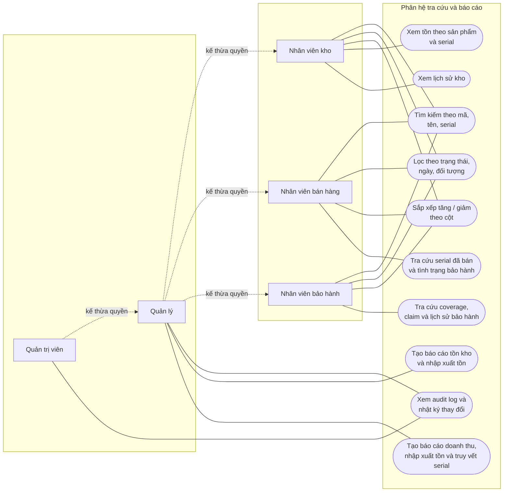
```mermaid
flowchart LR
    subgraph LeftActors[" "]
        direction TB
        Admin["Quản trị viên"]
        Manager["Quản lý"]
    end

    subgraph Inquiry["Phân hệ tra cứu và báo cáo"]
        direction TB
        UC1(["Tìm kiếm theo mã,<br/>tên, serial"])
        UC2(["Lọc theo trạng thái,<br/>ngày, đối tượng"])
        UC3(["Sắp xếp tăng / giảm<br/>theo cột"])
        UC4(["Xem tồn theo sản phẩm<br/>và serial"])
        UC5(["Xem lịch sử kho"])
        UC6(["Tra cứu serial đã bán<br/>và tình trạng bảo hành"])
        UC7(["Tra cứu coverage,<br/>claim và lịch sử bảo hành"])
        UC8(["Xem audit log và<br/>nhật ký thay đổi"])
        UC9(["Tạo báo cáo tồn kho<br/>và nhập xuất tồn"])
        UC10(["Tạo báo cáo doanh thu,<br/>nhập xuất tồn và truy vết serial"])
    end

    subgraph RightActors[" "]
        direction TB
        Storekeeper["Nhân viên kho"]
        Salesman["Nhân viên bán hàng"]
        Technician["Nhân viên bảo hành"]
    end

    Admin -. kế thừa quyền .-> Manager
    Manager -. kế thừa quyền .-> Storekeeper
    Manager -. kế thừa quyền .-> Salesman
    Manager -. kế thừa quyền .-> Technician

    Admin --- UC8
    Manager --- UC8
    Manager --- UC9
    Manager --- UC10

    Storekeeper --- UC1
    Storekeeper --- UC2
    Storekeeper --- UC3
    Storekeeper --- UC4
    Storekeeper --- UC5

    Salesman --- UC1
    Salesman --- UC2
    Salesman --- UC3
    Salesman --- UC6

    Technician --- UC1
    Technician --- UC2
    Technician --- UC3
    Technician --- UC7
```

---

## 4. Use case nhập xuất kho và hóa đơn

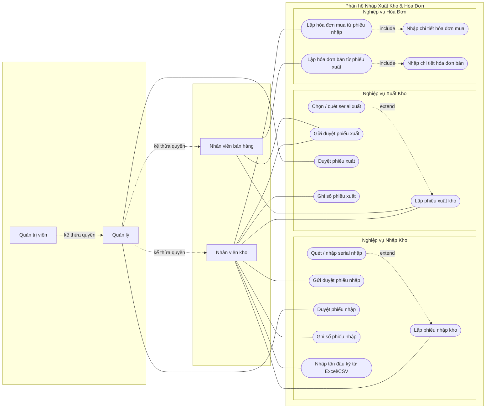
```mermaid
flowchart LR
    subgraph LeftActors[" "]
        direction TB
        Admin["Quản trị viên"]
        Manager["Quản lý"]
    end

    subgraph System["Phân hệ Nhập Xuất Kho & Hóa Đơn"]
        subgraph Inbound["Nghiệp vụ Nhập Kho"]
            UC1_in(["Lập phiếu nhập kho"])
            UC2_in(["Quét / nhập serial nhập"])
            UC3_in(["Gửi duyệt phiếu nhập"])
            UC4_in(["Duyệt phiếu nhập"])
            UC5_in(["Ghi sổ phiếu nhập"])
            UC8_in(["Nhập tồn đầu kỳ từ Excel/CSV"])
        end

        subgraph Outbound["Nghiệp vụ Xuất Kho"]
            UC1_out(["Lập phiếu xuất kho"])
            UC2_out(["Chọn / quét serial xuất"])
            UC3_out(["Gửi duyệt phiếu xuất"])
            UC4_out(["Duyệt phiếu xuất"])
            UC5_out(["Ghi sổ phiếu xuất"])
        end

        subgraph Invoicing["Nghiệp vụ Hóa Đơn"]
            UC6_in(["Lập hóa đơn mua từ phiếu nhập"])
            UC7_in(["Nhập chi tiết hóa đơn mua"])
            UC6_out(["Lập hóa đơn bán từ phiếu xuất"])
            UC7_out(["Nhập chi tiết hóa đơn bán"])
        end
    end

    subgraph RightActors[" "]
        direction TB
        Storekeeper["Nhân viên kho"]
        Salesman["Nhân viên bán hàng"]
    end

    Admin -. kế thừa quyền .-> Manager
    Manager -. kế thừa quyền .-> Storekeeper
    Manager -. kế thừa quyền .-> Salesman

    Storekeeper --- UC1_in
    Storekeeper --- UC3_in
    Storekeeper --- UC5_in
    Storekeeper --- UC8_in
    Storekeeper --- UC6_in

    Storekeeper --- UC1_out
    Storekeeper --- UC3_out
    Storekeeper --- UC5_out

    Salesman --- UC1_out
    Salesman --- UC3_out
    Salesman --- UC6_out

    Manager --- UC4_in
    Manager --- UC4_out

    UC2_in -. extend .-> UC1_in
    UC2_out -. extend .-> UC1_out
    UC6_in -. include .-> UC7_in
    UC6_out -. include .-> UC7_out
```

Ghi chú:
- `Lập`, `Duyệt`, `Ghi sổ` là ba hành vi khác nhau.
- `Quét / nhập serial` chỉ phát sinh với sản phẩm có `IsSerialTracked = true`.
- `Nhập tồn đầu kỳ từ Excel/CSV` sinh `StockIn` loại `OpeningBalance` và dùng kho mặc định đang được ẩn khỏi UI.
- Các bước nội bộ như quy đổi đơn vị, cập nhật tồn và ghi ledger được thể hiện ở activity/sequence.

---

## 5. Use case kiểm kê, điều chỉnh tồn và đảo nghiệp vụ

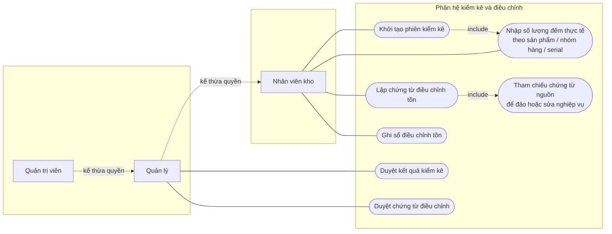
```mermaid
flowchart LR
    subgraph LeftActors[" "]
        direction TB
        Admin["Quản trị viên"]
        Manager["Quản lý"]
    end

    subgraph Control["Phân hệ kiểm kê và điều chỉnh"]
        direction TB
        UC1(["Khởi tạo phiên kiểm kê"])
        UC2(["Nhập số lượng đếm thực tế<br/>theo sản phẩm / nhóm hàng / serial"])
        UC3(["Duyệt kết quả kiểm kê"])
        UC4(["Lập chứng từ điều chỉnh tồn"])
        UC5(["Tham chiếu chứng từ nguồn<br/>để đảo hoặc sửa nghiệp vụ"])
        UC6(["Duyệt chứng từ điều chỉnh"])
        UC7(["Ghi sổ điều chỉnh tồn"])
    end

    subgraph RightActors[" "]
        direction TB
        Storekeeper["Nhân viên kho"]
    end

    Admin -. kế thừa quyền .-> Manager
    Manager -. kế thừa quyền .-> Storekeeper

    Storekeeper --- UC1
    Storekeeper --- UC2
    Storekeeper --- UC4
    Storekeeper --- UC7
    Manager --- UC3
    Manager --- UC6

    UC1 -. include .-> UC2
    UC4 -. include .-> UC5
```

---

## 6. Use case bảo hành

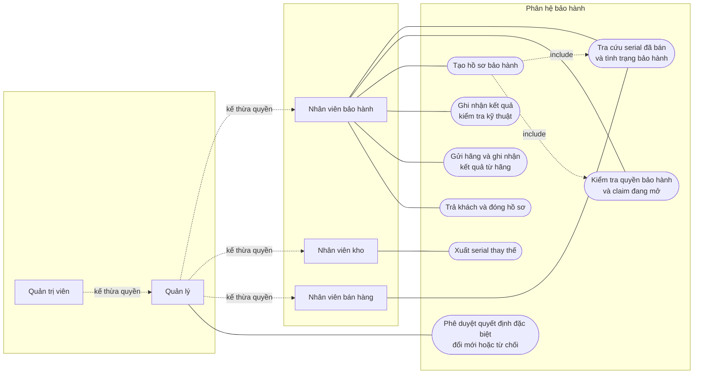
```mermaid
flowchart LR
    subgraph LeftActors[" "]
        direction TB
        Admin["Quản trị viên"]
        Manager["Quản lý"]
    end

    subgraph Warranty["Phân hệ bảo hành"]
        direction TB
        UC1(["Tra cứu serial đã bán<br/>và tình trạng bảo hành"])
        UC2(["Kiểm tra quyền bảo hành<br/>và claim đang mở"])
        UC3(["Tạo hồ sơ bảo hành"])
        UC4(["Ghi nhận kết quả<br/>kiểm tra kỹ thuật"])
        UC5(["Phê duyệt quyết định đặc biệt<br/>đổi mới hoặc từ chối"])
        UC6(["Gửi hãng và ghi nhận<br/>kết quả từ hãng"])
        UC7(["Xuất serial thay thế"])
        UC8(["Trả khách và đóng hồ sơ"])
    end

    subgraph RightActors[" "]
        direction TB
        Technician["Nhân viên bảo hành"]
        Storekeeper["Nhân viên kho"]
        Salesman["Nhân viên bán hàng"]
    end

    Admin -. kế thừa quyền .-> Manager
    Manager -. kế thừa quyền .-> Technician
    Manager -. kế thừa quyền .-> Storekeeper
    Manager -. kế thừa quyền .-> Salesman

    Technician --- UC1
    Technician --- UC2
    Technician --- UC3
    Technician --- UC4
    Technician --- UC6
    Technician --- UC8
    Storekeeper --- UC7
    Salesman --- UC1
    Manager --- UC5

    UC3 -. include .-> UC1
    UC3 -. include .-> UC2
```

Ghi chú:
- Kho chỉ tham gia khi có đổi mới và cần xuất serial thay thế.
- Nếu hãng sửa được thì máy trả thẳng cho khách, không phát sinh xuất máy mới.
- Các bước cập nhật trạng thái serial, coverage và claim được mô tả ở activity/sequence thay vì vẽ thành use case riêng.

---

## 7. Activity ghi sổ phiếu nhập

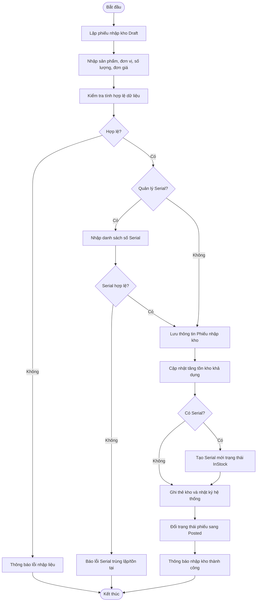
```mermaid
flowchart TD
    A([Bắt đầu]) --> B[Lập phiếu nhập kho Draft]
    B --> C[Nhập sản phẩm, đơn vị, số lượng, đơn giá]
    C --> D[Kiểm tra tính hợp lệ dữ liệu]
    D --> E{Hợp lệ?}
    E -- Không --> F[Thông báo lỗi nhập liệu] --> END([Kết thúc])
    E -- Có --> G{Quản lý Serial?}
    G -- Có --> H[Nhập danh sách số Serial]
    H --> I{Serial hợp lệ?}
    I -- Không --> J[Báo lỗi Serial trùng lặp/tồn tại] --> END
    I -- Có --> K[Lưu thông tin Phiếu nhập kho]
    G -- Không --> K
    K --> L[Cập nhật tăng tồn kho khả dụng]
    L --> M{Có Serial?}
    M -- Có --> N[Tạo Serial mới trạng thái InStock]
    M -- Không --> O[Ghi thẻ kho và nhật ký hệ thống]
    N --> O
    O --> P[Đổi trạng thái phiếu sang Posted]
    P --> Q[Thông báo nhập kho thành công]
    Q --> END
```

---

## 7A. Activity nhập tồn đầu kỳ từ Excel/CSV

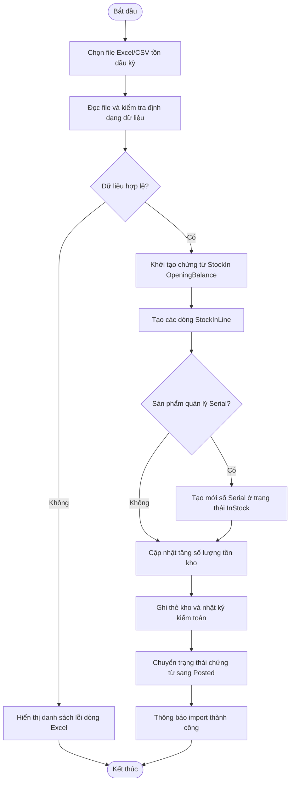
```mermaid
flowchart TD
    A([Bắt đầu]) --> B[Chọn file Excel/CSV tồn đầu kỳ]
    B --> C[Đọc file và kiểm tra định dạng dữ liệu]
    C --> D{Dữ liệu hợp lệ?}
    D -- Không --> E[Hiển thị danh sách lỗi dòng Excel] --> END([Kết thúc])
    D -- Có --> F[Khởi tạo chứng từ StockIn OpeningBalance]
    F --> G[Tạo các dòng StockInLine]
    G --> H{Sản phẩm quản lý Serial?}
    H -- Có --> I[Tạo mới số Serial ở trạng thái InStock]
    H -- Không --> J[Cập nhật tăng số lượng tồn kho]
    I --> J
    J --> K[Ghi thẻ kho và nhật ký kiểm toán]
    K --> L[Chuyển trạng thái chứng từ sang Posted]
    L --> M[Thông báo import thành công]
    M --> END
```

---

## 8. Activity ghi sổ phiếu xuất

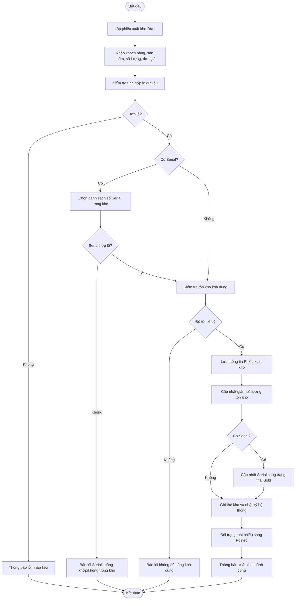
```mermaid
flowchart TD
    A([Bắt đầu]) --> B[Lập phiếu xuất kho Draft]
    B --> C[Nhập khách hàng, sản phẩm, số lượng, đơn giá]
    C --> D[Kiểm tra tính hợp lệ dữ liệu]
    D --> E{Hợp lệ?}
    E -- Không --> F[Thông báo lỗi nhập liệu] --> END([Kết thúc])
    E -- Có --> G{Có Serial?}
    G -- Có --> H[Chọn danh sách số Serial trong kho]
    H --> I{Serial hợp lệ?}
    I -- Không --> J[Báo lỗi Serial không khớp/không trong kho] --> END
    I -- Có --> K[Kiểm tra tồn kho khả dụng]
    G -- Không --> K
    K --> L{Đủ tồn kho?}
    L -- Không --> M[Báo lỗi không đủ hàng khả dụng] --> END
    L -- Có --> N[Lưu thông tin Phiếu xuất kho]
    N --> O[Cập nhật giảm số lượng tồn kho]
    O --> P{Có Serial?}
    P -- Có --> Q[Cập nhật Serial sang trạng thái Sold]
    P -- Không --> R[Ghi thẻ kho và nhật ký hệ thống]
    Q --> R
    R --> S[Đổi trạng thái phiếu sang Posted]
    S --> T[Thông báo xuất kho thành công]
    T --> END
```

---

## 9. Activity kiểm kê và điều chỉnh tồn

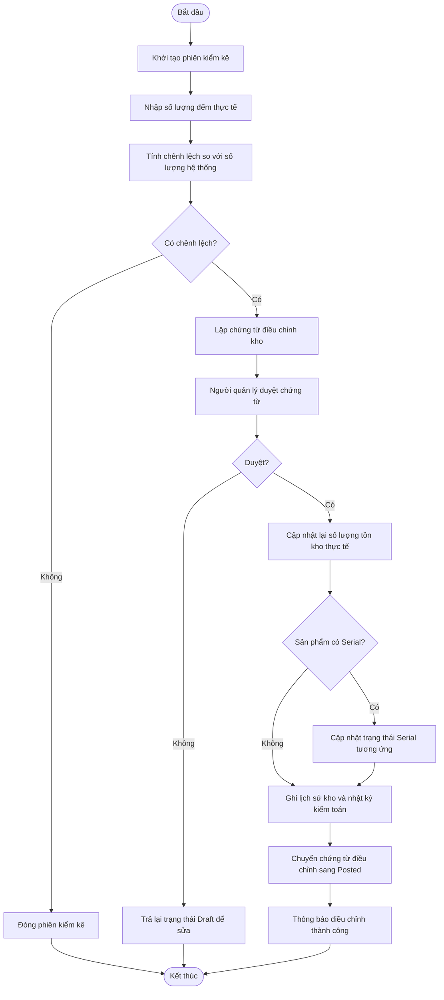
```mermaid
flowchart TD
    A([Bắt đầu]) --> B[Khởi tạo phiên kiểm kê]
    B --> C[Nhập số lượng đếm thực tế]
    C --> D[Tính chênh lệch so với số lượng hệ thống]
    D --> E{Có chênh lệch?}
    E -- Không --> F[Đóng phiên kiểm kê] --> END([Kết thúc])
    E -- Có --> G[Lập chứng từ điều chỉnh kho]
    G --> H[Người quản lý duyệt chứng từ]
    H --> I{Duyệt?}
    I -- Không --> J[Trả lại trạng thái Draft để sửa] --> END
    I -- Có --> K[Cập nhật lại số lượng tồn kho thực tế]
    K --> L{Sản phẩm có Serial?}
    L -- Có --> M[Cập nhật trạng thái Serial tương ứng]
    L -- Không --> N[Ghi lịch sử kho và nhật ký kiểm toán]
    M --> N
    N --> O[Chuyển chứng từ điều chỉnh sang Posted]
    O --> P[Thông báo điều chỉnh thành công]
    P --> END
```

---

## 10. Activity xử lý bảo hành và đổi mới

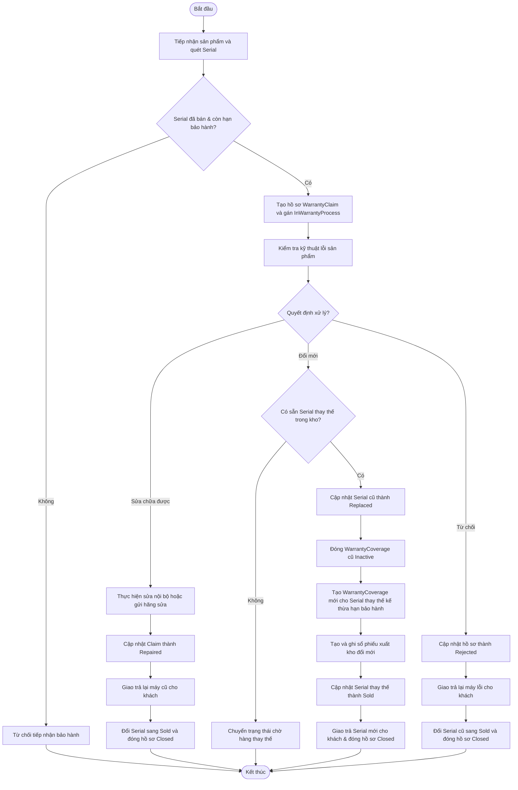
```mermaid
flowchart TD
    A([Bắt đầu]) --> B[Tiếp nhận sản phẩm và quét Serial]
    B --> C{Serial đã bán & còn hạn bảo hành?}
    C -- Không --> D[Từ chối tiếp nhận bảo hành] --> END([Kết thúc])
    C -- Có --> E[Tạo hồ sơ WarrantyClaim và gán InWarrantyProcess]
    E --> F[Kiểm tra kỹ thuật lỗi sản phẩm]
    F --> G{Quyết định xử lý?}
    G -- Sửa chữa được --> H[Thực hiện sửa nội bộ hoặc gửi hãng sửa]
    H --> I[Cập nhật Claim thành Repaired]
    I --> J[Giao trả lại máy cũ cho khách]
    J --> K[Đổi Serial sang Sold và đóng hồ sơ Closed] --> END
    G -- Đổi mới --> L{Có sẵn Serial thay thế trong kho?}
    L -- Không --> M[Chuyển trạng thái chờ hàng thay thế] --> END
    L -- Có --> N[Cập nhật Serial cũ thành Replaced]
    N --> O[Đóng WarrantyCoverage cũ Inactive]
    O --> P[Tạo WarrantyCoverage mới cho Serial thay thế kế thừa hạn bảo hành]
    P --> Q[Tạo và ghi sổ phiếu xuất kho đổi mới]
    Q --> R[Cập nhật Serial thay thế thành Sold]
    R --> S[Giao trả Serial mới cho khách & đóng hồ sơ Closed] --> END
    G -- Từ chối --> T[Cập nhật hồ sơ thành Rejected]
    T --> U[Giao trả lại máy lỗi cho khách]
    U --> V[Đổi Serial cũ sang Sold và đóng hồ sơ Closed] --> END
```
```

---

## 11. Sequence đăng nhập

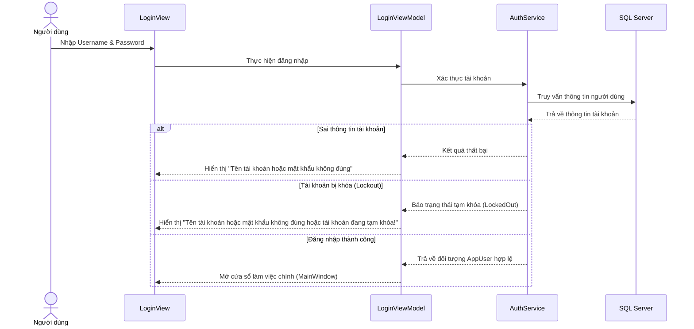
```mermaid
sequenceDiagram
    actor User as Người dùng
    participant UI as LoginView
    participant VM as LoginViewModel
    participant Auth as AuthService
    participant DB as SQL Server

    User->>UI: Nhập Username & Password
    UI->>VM: Thực hiện đăng nhập
    VM->>Auth: Xác thực tài khoản
    Auth->>DB: Truy vấn thông tin người dùng
    DB-->>Auth: Trả về thông tin tài khoản

    alt Sai thông tin tài khoản
        Auth-->>VM: Kết quả thất bại
        VM-->>UI: Hiển thị "Tên tài khoản hoặc mật khẩu không đúng"
    else Tài khoản bị khóa (Lockout)
        Auth-->>VM: Báo trạng thái tạm khóa (LockedOut)
        VM-->>UI: Hiển thị "Tên tài khoản hoặc mật khẩu không đúng hoặc tài khoản đang tạm khóa!"
    else Đăng nhập thành công
        Auth-->>VM: Trả về đối tượng AppUser hợp lệ
        VM-->>UI: Mở cửa sổ làm việc chính (MainWindow)
    end
```

---

## 12. Sequence ghi sổ phiếu nhập

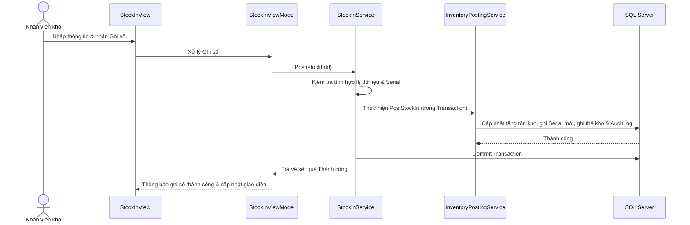
```mermaid
sequenceDiagram
    actor Storekeeper as Nhân viên kho
    participant UI as StockInView
    participant VM as StockInViewModel
    participant Service as StockInService
    participant Post as InventoryPostingService
    participant DB as SQL Server

    Storekeeper->>UI: Nhập thông tin & nhấn Ghi sổ
    UI->>VM: Xử lý Ghi sổ
    VM->>Service: Post(stockInId)
    Service->>Service: Kiểm tra tính hợp lệ dữ liệu & Serial
    Service->>Post: Thực hiện PostStockIn (trong Transaction)
    Post->>DB: Cập nhật tăng tồn kho, ghi Serial mới, ghi thẻ kho & AuditLog
    DB-->>Post: Thành công
    Service->>DB: Commit Transaction
    Service-->>VM: Trả về kết quả Thành công
    VM-->>UI: Thông báo ghi sổ thành công & cập nhật giao diện
```

---

## 12A. Sequence nhập tồn đầu kỳ từ Excel/CSV

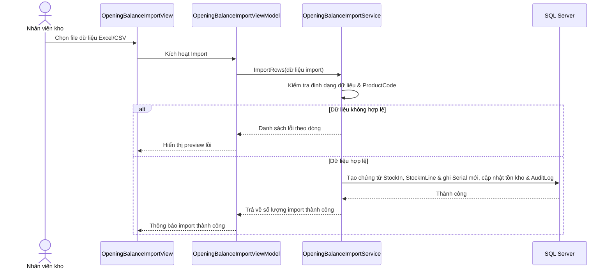
```mermaid
sequenceDiagram
    actor Storekeeper as Nhân viên kho
    participant UI as OpeningBalanceImportView
    participant VM as OpeningBalanceImportViewModel
    participant Import as OpeningBalanceImportService
    participant DB as SQL Server

    Storekeeper->>UI: Chọn file dữ liệu Excel/CSV
    UI->>VM: Kích hoạt Import
    VM->>Import: ImportRows(dữ liệu import)
    Import->>Import: Kiểm tra định dạng dữ liệu & ProductCode
    
    alt Dữ liệu không hợp lệ
        Import-->>VM: Danh sách lỗi theo dòng
        VM-->>UI: Hiển thị preview lỗi
    else Dữ liệu hợp lệ
        Import->>DB: Tạo chứng từ StockIn, StockInLine & ghi Serial mới, cập nhật tồn kho & AuditLog
        DB-->>Import: Thành công
        Import-->>VM: Trả về số lượng import thành công
        VM-->>UI: Thông báo import thành công
    end
```

---

## 13. Sequence ghi sổ phiếu xuất

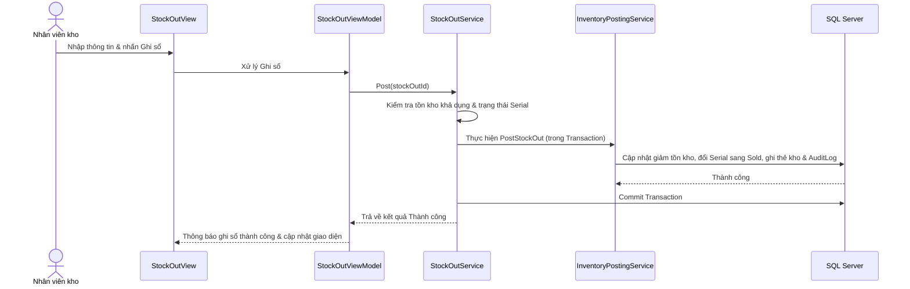
```mermaid
sequenceDiagram
    actor Storekeeper as Nhân viên kho
    participant UI as StockOutView
    participant VM as StockOutViewModel
    participant Service as StockOutService
    participant Post as InventoryPostingService
    participant DB as SQL Server

    Storekeeper->>UI: Nhập thông tin & nhấn Ghi sổ
    UI->>VM: Xử lý Ghi sổ
    VM->>Service: Post(stockOutId)
    Service->>Service: Kiểm tra tồn kho khả dụng & trạng thái Serial
    Service->>Post: Thực hiện PostStockOut (trong Transaction)
    Post->>DB: Cập nhật giảm tồn kho, đổi Serial sang Sold, ghi thẻ kho & AuditLog
    DB-->>Post: Thành công
    Service->>DB: Commit Transaction
    Service-->>VM: Trả về kết quả Thành công
    VM-->>UI: Thông báo ghi sổ thành công & cập nhật giao diện
```

---

## 14. Sequence bảo hành đổi mới

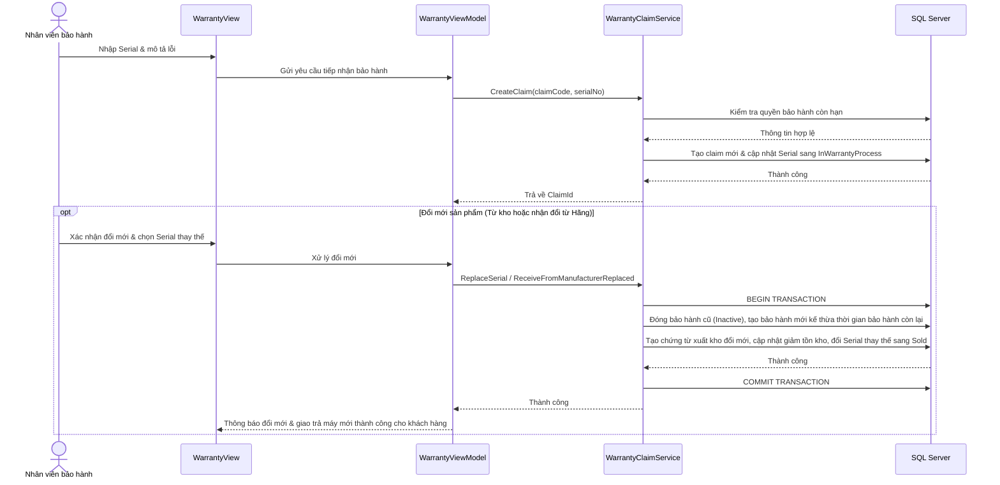
```mermaid
sequenceDiagram
    actor Technician as Nhân viên bảo hành
    participant UI as WarrantyView
    participant VM as WarrantyViewModel
    participant Service as WarrantyClaimService
    participant DB as SQL Server

    Technician->>UI: Nhập Serial & mô tả lỗi
    UI->>VM: Gửi yêu cầu tiếp nhận bảo hành
    VM->>Service: CreateClaim(claimCode, serialNo)
    Service->>DB: Kiểm tra quyền bảo hành còn hạn
    DB-->>Service: Thông tin hợp lệ
    Service->>DB: Tạo claim mới & cập nhật Serial sang InWarrantyProcess
    DB-->>Service: Thành công
    Service-->>VM: Trả về ClaimId

    opt Đổi mới sản phẩm (Từ kho hoặc nhận đổi từ Hãng)
        Technician->>UI: Xác nhận đổi mới & chọn Serial thay thế
        UI->>VM: Xử lý đổi mới
        VM->>Service: ReplaceSerial / ReceiveFromManufacturerReplaced
        Service->>DB: BEGIN TRANSACTION
        Service->>DB: Đóng bảo hành cũ (Inactive), tạo bảo hành mới kế thừa thời gian bảo hành còn lại
        Service->>DB: Tạo chứng từ xuất kho đổi mới, cập nhật giảm tồn kho, đổi Serial thay thế sang Sold
        DB-->>Service: Thành công
        Service->>DB: COMMIT TRANSACTION
        Service-->>VM: Thành công
        VM-->>UI: Thông báo đổi mới & giao trả máy mới thành công cho khách hàng
    end
```
```

---

## 15. State vòng đời chứng từ kho

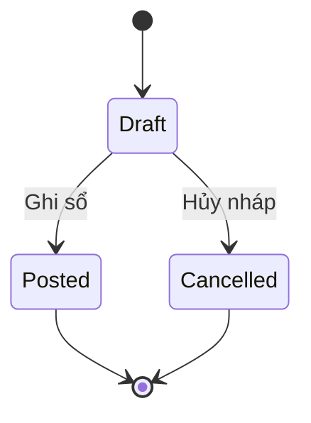
```mermaid
stateDiagram-v2
    [*] --> Draft
    Draft --> Posted: Ghi sổ
    Draft --> Cancelled: Hủy nháp
    Posted --> [*]
    Cancelled --> [*]
```

| Transition | Người thực hiện |
| --- | --- |
| `Draft -> Posted` | Người lập chứng từ hoặc nhân viên kho |
| `Draft -> Cancelled` | Người lập hoặc quản lý |

Ghi chú:
- Người lập chứng từ có quyền ghi sổ trực tiếp mà không cần qua bước phê duyệt trung gian trong phase này.


---

## 16. State vòng đời hồ sơ bảo hành

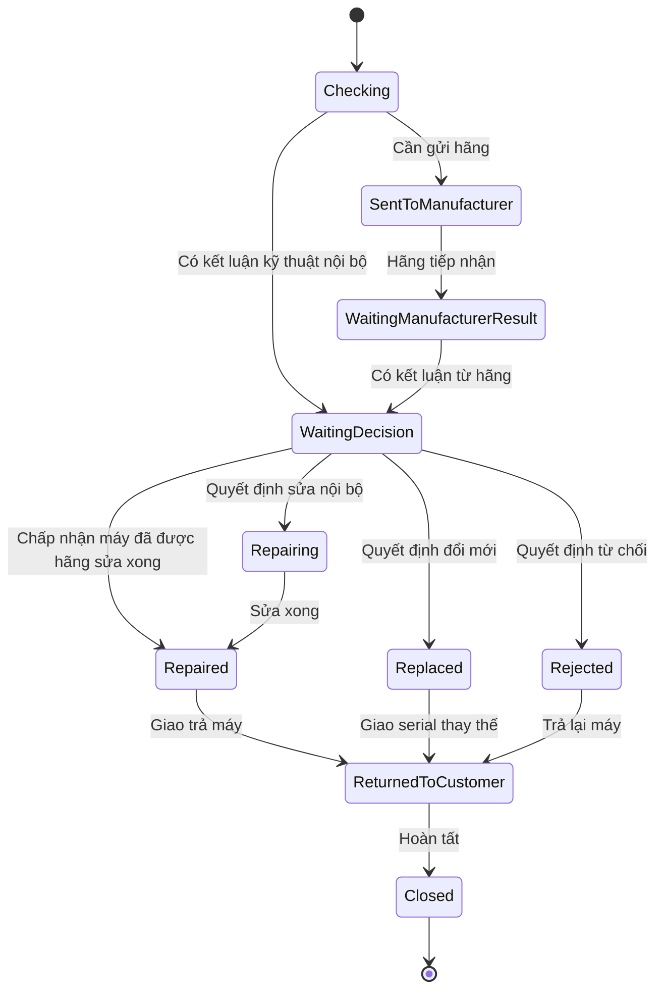
```mermaid
stateDiagram-v2
    [*] --> Checking
    Checking --> WaitingDecision: Có kết luận kỹ thuật nội bộ
    Checking --> SentToManufacturer: Cần gửi hãng
    SentToManufacturer --> WaitingManufacturerResult: Hãng tiếp nhận
    WaitingManufacturerResult --> WaitingDecision: Có kết luận từ hãng
    WaitingDecision --> Repairing: Quyết định sửa nội bộ
    WaitingDecision --> Repaired: Chấp nhận máy đã được hãng sửa xong
    WaitingDecision --> Replaced: Quyết định đổi mới
    WaitingDecision --> Rejected: Quyết định từ chối
    Repairing --> Repaired: Sửa xong
    Repaired --> ReturnedToCustomer: Giao trả máy
    Replaced --> ReturnedToCustomer: Giao serial thay thế
    Rejected --> ReturnedToCustomer: Trả lại máy
    ReturnedToCustomer --> Closed: Hoàn tất
    Closed --> [*]
```

Ghi chú:
- `WarrantyClaim` được tạo từ trạng thái `Checking`; các trường hợp không đủ điều kiện hoặc đã có claim mở sẽ bị chặn trước khi tạo hồ sơ.
- `Rejected` không đóng hồ sơ ngay; phải qua bước trả lại máy hoặc xác nhận giao nhận rồi mới `Closed`.
- Nếu đổi mới nhưng thiếu hàng thay thế thì claim quay về `WaitingDecision`, giữ mở để chờ nhập hàng hoặc quyết định nghiệp vụ khác.

---

## 17. ERD chi tiết đầy đủ mọi bảng và tất cả liên kết


```mermaid
erDiagram
    AppUser {
        int Id PK
        string Username
        string PasswordHash
        string FullName
        string RoleCode
        bool MustChangePassword
        int FailedLoginCount
        int CreatedBy FK "nullable"
        datetime CreatedAt
        datetime LockoutUntil "nullable"
        datetime LastFailedLoginAt "nullable"
        datetime LastPasswordChangedAt "nullable"
        datetime LastLoginAt "nullable"
        bool IsActive
    }

    Category {
        int Id PK
        string CategoryCode
        string DisplayName
        bool IsActive
    }

    Brand {
        int Id PK
        string BrandCode
        string DisplayName
        string OriginCountry
        bool IsActive
    }

    Unit {
        int Id PK
        string UnitCode
        string DisplayName
        bool IsActive
    }

    Supplier {
        int Id PK
        string SupplierCode
        string DisplayName
        string Phone
        string Email
        bool IsActive
    }

    Customer {
        int Id PK
        string CustomerCode
        string DisplayName
        string Phone
        string Email
        bool IsActive
    }

    Warehouse {
        int Id PK
        string WarehouseCode UK
        string DisplayName
        bool IsDefault
        bool IsActive
    }

    Product {
        int Id PK
        string ProductCode UK
        string DisplayName
        int CategoryId FK
        int BrandId FK
        int DefaultUnitId FK
        decimal DefaultPrice
        string OriginCountry
        int WarrantyPeriodMonths
        bool IsSerialTracked
        bool IsActive
    }

    ProductUnit {
        int Id PK
        int ProductId FK
        int UnitId FK
        decimal ConversionFactor
        bool IsBaseUnit
        bool IsPurchaseUnit
        bool IsSalesUnit
        string UQ_ProductUnit "UNIQUE (ProductId, UnitId)"
    }

    StockBalance {
        int Id PK
        int WarehouseId FK
        int ProductId FK
        decimal OnHandQuantity
        decimal AvailableQuantity
        decimal ReservedQuantity
        string UQ_StockBalance "UNIQUE (WarehouseId, ProductId)"
    }

    StockIn {
        int Id PK
        string DocumentCode UK
        int SupplierId FK "nullable"
        int WarehouseId FK
        string PurposeCode
        string Status
        int CreatedBy FK
        int ApprovedBy FK "nullable"
        int PostedBy FK "nullable"
        datetime CreatedAt
        datetime ApprovedAt "nullable"
        datetime PostedAt "nullable"
    }

    StockInLine {
        int Id PK
        int StockInId FK
        int ProductId FK
        int UnitId FK
        decimal Quantity
        decimal BaseQuantity
        decimal UnitPrice
    }

    StockOut {
        int Id PK
        string DocumentCode UK
        int CustomerId FK
        int WarehouseId FK
        string PurposeCode
        string Status
        int CreatedBy FK
        int ApprovedBy FK "nullable"
        int PostedBy FK "nullable"
        datetime CreatedAt
        datetime ApprovedAt "nullable"
        datetime PostedAt "nullable"
    }

    StockOutLine {
        int Id PK
        int StockOutId FK
        int ProductId FK
        int UnitId FK
        decimal Quantity
        decimal BaseQuantity
        decimal UnitPrice
    }

    StockCountSession {
        int Id PK
        string SessionCode UK
        int WarehouseId FK
        string Status
        int CreatedBy FK
        int ApprovedBy FK "nullable"
        int PostedBy FK "nullable"
        datetime CountDate
        datetime ApprovedAt "nullable"
        datetime PostedAt "nullable"
    }

    StockCountLine {
        int Id PK
        int SessionId FK
        int ProductId FK
        decimal SystemQuantity
        decimal CountedQuantity
        decimal VarianceQuantity
    }

    StockAdjustment {
        int Id PK
        string DocumentCode UK
        int WarehouseId FK
        string AdjustmentType
        string Status
        string ReferenceDocumentType
        int ReferenceDocumentId
        string ReasonCode
        int CreatedBy FK
        int ApprovedBy FK "nullable"
        int PostedBy FK "nullable"
        datetime ApprovedAt "nullable"
        datetime PostedAt "nullable"
    }

    StockAdjustmentLine {
        int Id PK
        int AdjustmentId FK
        int ProductId FK
        int ProductSerialId FK "nullable"
        decimal QuantityDelta
        decimal BaseQuantityDelta
        string Direction
    }

    PurchaseInvoice {
        int Id PK
        string InvoiceCode UK
        int SupplierId FK
        int StockInId FK "nullable"
        datetime InvoiceDate
        decimal SubTotal
        decimal TaxAmount
        decimal GrandTotal
        decimal PaidAmount
        string PaymentStatus
        datetime DueDate
    }

    PurchaseInvoiceLine {
        int Id PK
        int PurchaseInvoiceId FK
        int ProductId FK
        int UnitId FK
        int StockInLineId FK "nullable"
        decimal Quantity
        decimal UnitPrice
        decimal SubTotal
        decimal TaxRate
        decimal TaxAmount
        decimal GrandTotal
    }

    SalesInvoice {
        int Id PK
        string InvoiceCode UK
        int CustomerId FK
        int StockOutId FK "nullable"
        datetime InvoiceDate
        decimal SubTotal
        decimal TaxAmount
        decimal GrandTotal
        decimal PaidAmount
        string PaymentStatus
        datetime DueDate
    }

    SalesInvoiceLine {
        int Id PK
        int SalesInvoiceId FK
        int ProductId FK
        int UnitId FK
        int StockOutLineId FK "nullable"
        decimal Quantity
        decimal UnitPrice
        decimal SubTotal
        decimal TaxRate
        decimal TaxAmount
        decimal GrandTotal
    }

    ProductSerial {
        int Id PK
        int ProductId FK
        string SerialNumber UK
        string CurrentStatus
        int CurrentWarehouseId FK "nullable"
        int LastStockInLineId FK
        int LastStockOutLineId FK "nullable"
    }

    StockLedger {
        int Id PK
        int WarehouseId FK
        int ProductId FK
        int ProductSerialId FK "nullable"
        string SourceDocumentType
        int SourceDocumentId
        string MovementType
        decimal Quantity
        int PostedBy FK
        datetime PostedAt
    }

    WarrantyCoverage {
        int Id PK
        int ProductSerialId FK
        int CustomerId FK
        int SalesInvoiceId FK "nullable"
        datetime WarrantyStartDate
        datetime WarrantyEndDate
        string CoverageStatus
        string UX_ActiveCoverage "FILTERED UNIQUE Active/ProductSerialId"
    }

    WarrantyClaim {
        int Id PK
        string ClaimCode UK
        int WarrantyCoverageId FK
        int ProductSerialId FK
        int ReplacementSerialId FK "nullable"
        int ReplacementStockOutId FK "nullable"
        datetime ReceivedDate
        string ProblemDescription
        string TechnicalConclusion
        string ManufacturerResult
        string RejectionReason
        string ProcessingNote
        string ResolutionType
        string Status
        int ApprovedBy FK "nullable"
        int ProcessedBy FK
        datetime ClosedDate "nullable"
        string UX_OpenClaim "FILTERED UNIQUE Open/ProductSerialId"
    }

    AuditLog {
        int Id PK
        string EntityName
        int EntityId
        string ActionCode
        string BeforeJson
        string AfterJson
        int PerformedBy FK
        datetime PerformedAt
    }

    Category ||--o{ Product : categoryId
    Brand ||--o{ Product : brandId
    Unit ||--o{ Product : defaultUnitId
    Product ||--o{ ProductUnit : productId
    Unit ||--o{ ProductUnit : unitId

    Warehouse ||--o{ StockBalance : warehouseId
    Product ||--o{ StockBalance : productId

    Supplier |o--o{ StockIn : supplierId
    Warehouse ||--o{ StockIn : warehouseId
    StockIn ||--o{ StockInLine : stockInId
    Product ||--o{ StockInLine : productId
    Unit ||--o{ StockInLine : unitId

    Warehouse ||--o{ StockOut : warehouseId
    Customer ||--o{ StockOut : customerId
    StockOut ||--o{ StockOutLine : stockOutId
    Product ||--o{ StockOutLine : productId
    Unit ||--o{ StockOutLine : unitId

    Warehouse ||--o{ StockCountSession : warehouseId
    StockCountSession ||--o{ StockCountLine : sessionId
    Product ||--o{ StockCountLine : productId

    Warehouse ||--o{ StockAdjustment : warehouseId
    StockAdjustment ||--o{ StockAdjustmentLine : adjustmentId
    Product ||--o{ StockAdjustmentLine : productId
    ProductSerial |o--o{ StockAdjustmentLine : productSerialId

    Supplier ||--o{ PurchaseInvoice : supplierId
    StockIn |o--o| PurchaseInvoice : stockInId
    PurchaseInvoice ||--o{ PurchaseInvoiceLine : purchaseInvoiceId
    Product ||--o{ PurchaseInvoiceLine : productId
    Unit ||--o{ PurchaseInvoiceLine : unitId
    StockInLine |o--o{ PurchaseInvoiceLine : stockInLineId
    Customer ||--o{ SalesInvoice : customerId
    StockOut |o--o| SalesInvoice : stockOutId
    SalesInvoice ||--o{ SalesInvoiceLine : salesInvoiceId
    Product ||--o{ SalesInvoiceLine : productId
    Unit ||--o{ SalesInvoiceLine : unitId
    StockOutLine |o--o{ SalesInvoiceLine : stockOutLineId

    Warehouse |o--o{ ProductSerial : currentWarehouseId
    Product ||--o{ ProductSerial : productId
    StockInLine ||--o{ ProductSerial : lastStockInLineId
    StockOutLine |o--o{ ProductSerial : lastStockOutLineId

    Warehouse ||--o{ StockLedger : warehouseId
    Product ||--o{ StockLedger : productId
    ProductSerial |o--o{ StockLedger : productSerialId

    ProductSerial ||--o{ WarrantyCoverage : productSerialId
    Customer ||--o{ WarrantyCoverage : customerId
    SalesInvoice |o--o{ WarrantyCoverage : salesInvoiceId

    WarrantyCoverage ||--o{ WarrantyClaim : warrantyCoverageId
    ProductSerial ||--o{ WarrantyClaim : productSerialId
    ProductSerial |o--o{ WarrantyClaim : replacementSerialId
    StockOut |o--o| WarrantyClaim : replacementStockOutId

    AppUser ||--o{ StockIn : createdBy
    AppUser |o--o{ AppUser : createdBy
    AppUser |o--o{ StockIn : approvedBy
    AppUser |o--o{ StockIn : postedBy
    AppUser ||--o{ StockOut : createdBy
    AppUser |o--o{ StockOut : approvedBy
    AppUser |o--o{ StockOut : postedBy
    AppUser ||--o{ StockCountSession : createdBy
    AppUser |o--o{ StockCountSession : approvedBy
    AppUser |o--o{ StockCountSession : postedBy
    AppUser ||--o{ StockAdjustment : createdBy
    AppUser |o--o{ StockAdjustment : approvedBy
    AppUser |o--o{ StockAdjustment : postedBy
    AppUser ||--o{ StockLedger : postedBy
    AppUser |o--o{ WarrantyClaim : approvedBy
    AppUser ||--o{ WarrantyClaim : processedBy
    AppUser ||--o{ AuditLog : performedBy
```

Ghi chú:
- Đây là bản ERD chi tiết đầy đủ mọi bảng và mọi FK cứng đang có trong mô hình hiện tại.
- `StockLedger.SourceDocumentType + SourceDocumentId` là tham chiếu nghiệp vụ đa hình, không phải một FK cứng tới một bảng duy nhất nên không thể vẽ như một liên kết database chuẩn.
- Các trường mã nghiệp vụ như `DocumentCode`, `InvoiceCode`, `SessionCode`, `ClaimCode`, `ProductCode`, `SerialNumber` phải có unique constraint hoặc unique index tương ứng ở mức database.
- `Warehouse` được thiết kế sẵn cho khả năng mở rộng nhiều kho, nhưng phase hiện tại chỉ vận hành với một kho mặc định và UI không cho người dùng chọn kho.
- `StockBalance` phải có unique constraint theo cặp `ProductId + WarehouseId`.
- `ProductUnit` cần thêm unique constraint theo cặp (`ProductId`, `UnitId`) và mỗi `Product` chỉ có một dòng `IsBaseUnit = true`.
- `WarrantyClaim` cần filtered unique index hoặc cơ chế tương đương để chặn hơn một claim mở trên cùng `ProductSerialId`.
- `WarrantyCoverage` nên có rule hoặc filtered unique index để chặn hơn một coverage active trên cùng `ProductSerialId`.
- Các FK và cột workflow có ghi `nullable` trong ERD phải được map là quan hệ tùy chọn khi sinh entity/database, gồm ít nhất: `StockIn.SupplierId`, `ProductSerial.CurrentWarehouseId`, `PurchaseInvoice.StockInId`, `SalesInvoice.StockOutId`, `WarrantyCoverage.SalesInvoiceId`, `WarrantyClaim.ReplacementSerialId`, `WarrantyClaim.ReplacementStockOutId`, `ApprovedBy`, `PostedBy`, `ApprovedAt`, `PostedAt`, `ClosedDate`.


