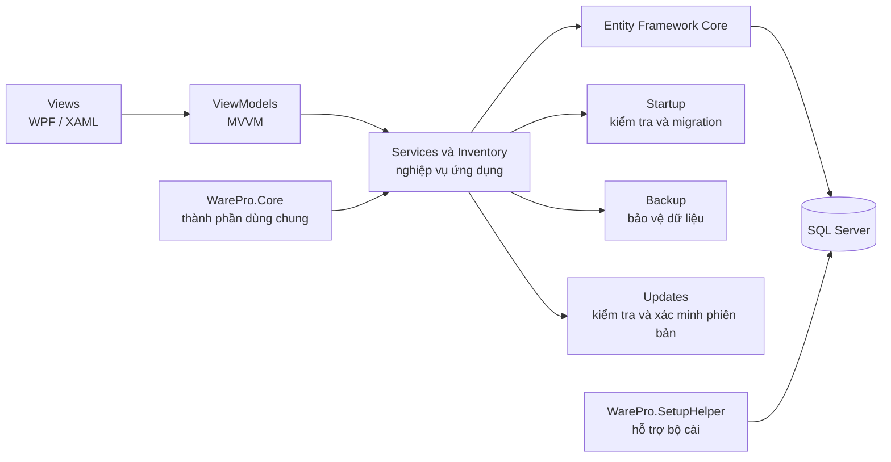

# WarePro

WarePro là phần mềm quản lý kho và hàng hóa chạy trên Windows, được xây dựng bằng WPF và .NET 8. Ứng dụng tập trung vào các nghiệp vụ nhập, xuất, tồn kho, kiểm kê, quản lý danh mục, đối tác, chứng từ, báo cáo và phân quyền người dùng.

Repository này chứa mã nguồn ứng dụng, bộ kiểm thử, công cụ hỗ trợ cài đặt, cấu hình bộ cài Inno Setup và quy trình phát hành phiên bản.

## Mục lục

- [Tính năng chính](#tính-năng-chính)
- [Kiến trúc](#kiến-trúc)
- [Công nghệ sử dụng](#công-nghệ-sử-dụng)
- [Yêu cầu hệ thống](#yêu-cầu-hệ-thống)
- [Cài đặt WarePro](#cài-đặt-warepro)
- [Cập nhật và khôi phục phiên bản](#cập-nhật-và-khôi-phục-phiên-bản)
- [Bắt đầu phát triển](#bắt-đầu-phát-triển)
- [Kiểm thử](#kiểm-thử)
- [Cấu trúc repository](#cấu-trúc-repository)
- [Cấu hình, dữ liệu và log](#cấu-hình-dữ-liệu-và-log)
- [Đóng gói và phát hành](#đóng-gói-và-phát-hành)
- [Tài liệu](#tài-liệu)
- [Xử lý sự cố](#xử-lý-sự-cố)
- [Giấy phép](#giấy-phép)

## Tính năng chính

WarePro hỗ trợ các nhóm nghiệp vụ sau:

- quản lý hàng hóa, nhóm hàng, đơn vị tính và thông tin liên quan;
- quản lý kho và số lượng tồn;
- lập và theo dõi phiếu nhập kho, phiếu xuất kho, hóa đơn và chứng từ;
- quản lý nhà cung cấp, khách hàng và thông tin đối tác;
- kiểm kê kho, đối chiếu số liệu và xử lý chênh lệch;
- theo dõi lịch sử giao dịch và biến động tồn kho;
- tra cứu, lọc, sắp xếp, nhập dữ liệu và xuất báo cáo;
- quản lý tài khoản, vai trò và quyền truy cập;
- sao lưu dữ liệu, kiểm tra phiên bản cơ sở dữ liệu và nâng cấp schema an toàn;
- kiểm tra bản cập nhật, tải bộ cài và xác minh chữ ký trước khi nâng cấp.

## Kiến trúc

Ứng dụng sử dụng mô hình MVVM. Giao diện chỉ phụ trách hiển thị và nhận thao tác; ViewModel điều phối trạng thái màn hình; các service xử lý nghiệp vụ, dữ liệu, sao lưu, migration và cập nhật phiên bản.



Các lớp chính được tổ chức như sau:

- `QuanLyHangHoa/Views`: giao diện WPF và các cửa sổ nghiệp vụ;
- `QuanLyHangHoa/ViewModels`: trạng thái, command và luồng tương tác của màn hình;
- `QuanLyHangHoa/Services`: dịch vụ nghiệp vụ, dữ liệu, báo cáo, sao lưu và hạ tầng;
- `QuanLyHangHoa/Inventory`: logic miền liên quan đến tồn kho;
- `QuanLyHangHoa/Data`: DbContext và cấu hình truy cập dữ liệu;
- `QuanLyHangHoa/Models`: mô hình dữ liệu và đối tượng trao đổi;
- `QuanLyHangHoa/Startup`: quy trình kiểm tra hệ thống khi ứng dụng khởi động;
- `QuanLyHangHoa/Updates`: kiểm tra, tải và xác minh bản cập nhật;
- `WarePro.Core`: mã dùng chung giữa ứng dụng và các công cụ liên quan;
- `WarePro.SetupHelper`: chương trình hỗ trợ bộ cài chuẩn bị SQL Server và cơ sở dữ liệu.

## Công nghệ sử dụng

| Thành phần | Công nghệ |
| --- | --- |
| Nền tảng | .NET 8, Windows Desktop |
| Giao diện | WPF, XAML, Material Design |
| Kiến trúc giao diện | MVVM, CommunityToolkit.Mvvm |
| Truy cập dữ liệu | Entity Framework Core 8 |
| Cơ sở dữ liệu | Microsoft SQL Server / SQL Server Express |
| Xử lý Excel và CSV | ClosedXML, CsvHelper |
| Biểu đồ | LiveChartsCore |
| Kiểm thử | xUnit, Moq, SQLite in-memory |
| Bộ cài | Inno Setup 6 |
| Tự động hóa phát hành | GitHub Actions, PowerShell |

## Yêu cầu hệ thống

### Máy người dùng

- Windows 11 x64 là môi trường triển khai chuẩn;
- Windows 10 22H2 x64 chỉ dùng khi tổ chức vẫn còn chính sách hỗ trợ nội bộ;
- tối thiểu 4 GB RAM, khuyến nghị 8 GB trở lên;
- quyền quản trị viên trong lúc cài đặt hoặc cập nhật;
- dung lượng trống đủ cho ứng dụng, SQL Server Express nếu chọn cài kèm, dữ liệu và bản sao lưu;
- kết nối mạng nếu tải SQL Server Express trong chế độ cài đầy đủ hoặc kiểm tra bản cập nhật trực tuyến.

Bản phát hành WarePro là bản self-contained, vì vậy máy người dùng không phải cài riêng .NET Desktop Runtime.

### Máy phát triển

- Windows 11, hoặc Windows 10 22H2 khi môi trường nội bộ vẫn còn hỗ trợ;
- .NET SDK 8 trở lên có khả năng build target `net8.0-windows`;
- SQL Server hoặc SQL Server Express khi cần chạy luồng dùng cơ sở dữ liệu thật;
- PowerShell;
- Inno Setup 6 nếu cần tạo bộ cài.

## Cài đặt WarePro

Bộ cài hỗ trợ hai chế độ. Người dùng chọn chế độ phù hợp ngay trong quá trình cài đặt.

| Chế độ | Thành phần được cài | Phù hợp với |
| --- | --- | --- |
| Cài đặt đầy đủ một lần bấm | WarePro và SQL Server Express | Máy đầu tiên, máy độc lập hoặc người dùng chưa có SQL Server |
| Chỉ cài WarePro | Chỉ phần mềm WarePro | Máy đã có SQL Server hoặc máy trạm dùng chung cơ sở dữ liệu trên máy chủ khác |

### Chế độ cài đặt đầy đủ

Chế độ này tự động cài WarePro, chuẩn bị SQL Server Express và tạo kết nối mặc định. Cấu hình mặc định sử dụng instance `.\SQLEXPRESS`, cơ sở dữ liệu `ProductManagementDb` và Windows Authentication.

Máy cần kết nối Internet nếu bộ cài phải tải gói SQL Server Express. Sau khi hoàn tất, người dùng có thể mở WarePro từ Start Menu hoặc shortcut trên Desktop nếu đã chọn tạo shortcut này trong bộ cài.

### Chế độ chỉ cài phần mềm

Chọn chế độ này nếu doanh nghiệp đã có SQL Server hoặc nhiều máy WarePro cần dùng chung một cơ sở dữ liệu. Trong wizard cài đặt, nhập máy chủ, instance, tên cơ sở dữ liệu và phương thức xác thực. Nếu dùng SQL Authentication, WarePro sẽ hỏi credential an toàn khi mở ứng dụng lần đầu thay vì truyền mật khẩu qua command line hoặc lưu trong tệp JSON.

Không nên cài một cơ sở dữ liệu riêng trên từng máy trạm nếu các máy cần nhìn thấy cùng số liệu nhập, xuất và tồn kho.

Hướng dẫn từng bước, cách chọn chế độ, cấu hình kết nối và gỡ cài đặt được trình bày tại [Hướng dẫn cài đặt WarePro trên Windows](docs/user-guides/WAREPRO_HUONG_DAN_CAI_DAT_WINDOWS.md).

## Cập nhật và khôi phục phiên bản

WarePro có luồng cập nhật để vá lỗi và bổ sung tính năng mà không yêu cầu người dùng cài lại từ đầu.

Quy trình cập nhật gồm các bước chính:

1. ứng dụng kiểm tra bản phát hành mới theo chu kỳ, tối đa một lần trong 24 giờ;
2. gói cài được tải xuống tệp tạm có đuôi `.partial`;
3. WarePro kiểm tra kích thước, mã SHA-256, chữ ký Authenticode, chuỗi chứng thư, dấu thời gian và nhà phát hành;
4. chỉ gói hợp lệ mới được phép chạy với quyền quản trị viên;
5. trước thay đổi schema, ứng dụng kiểm tra phiên bản cơ sở dữ liệu, khóa quá trình migration và tạo bản sao lưu theo chính sách;
6. migration được thiết kế để có thể chạy lại an toàn; mặc định chỉ seed dữ liệu ban đầu khi cơ sở dữ liệu chưa có người dùng, còn chế độ force-seed chỉ dành cho thao tác hỗ trợ có chủ đích.

Nếu máy không có Internet, WarePro vẫn cho đăng nhập khi phiên bản ứng dụng tương thích với schema hiện tại. Người quản trị cũng có thể tải bộ cài đã ký từ kênh phát hành chính thức và cập nhật thủ công.

Khi một bản cập nhật gây lỗi, không nên tự ý hạ schema bằng cách sửa trực tiếp cơ sở dữ liệu. Cần giữ bản sao lưu trước migration, xác định cặp phiên bản ứng dụng/schema tương thích, sau đó dùng bộ cài đã ký hoặc quy trình phục hồi do người quản trị phát hành cung cấp.

Chi tiết về đánh version, tạo manifest, ký số, smoke test và phát hành được ghi tại [WarePro Release Runbook](docs/operations/WAREPRO_RELEASE_RUNBOOK.md).

## Bắt đầu phát triển

Các lệnh dưới đây chạy từ thư mục gốc repository.

### 1. Khôi phục package

```powershell
dotnet restore QuanLyHangHoa\QuanLyHangHoa.sln
```

### 2. Build bản Release

```powershell
dotnet build QuanLyHangHoa\QuanLyHangHoa.sln --configuration Release
```

### 3. Chạy ứng dụng

```powershell
dotnet run --project QuanLyHangHoa\QuanLyHangHoa.csproj
```

Ở lần chạy đầu, ứng dụng yêu cầu cấu hình kết nối SQL Server nếu máy chưa có cấu hình hợp lệ. Không đưa mật khẩu hoặc connection string thật vào source control.

Trong một số môi trường Windows có giới hạn tiến trình MSBuild, restore hoặc build đa node có thể thoát mà không in lỗi rõ ràng. Khi gặp trường hợp này, chạy lại với một node:

```powershell
dotnet restore QuanLyHangHoa\QuanLyHangHoa.sln --disable-parallel -m:1
dotnet build QuanLyHangHoa\QuanLyHangHoa.sln --configuration Release --maxcpucount:1
```

## Kiểm thử

Chạy bộ test tự động không dùng cơ sở dữ liệu thật:

```powershell
dotnet test QuanLyHangHoa.Tests\QuanLyHangHoa.Tests.csproj --configuration Release --filter "Category!=RealDatabase"
```

Bộ test bao phủ logic nghiệp vụ, ViewModel, service, migration, cập nhật, in ấn và các hợp đồng quan trọng của bộ cài. Các test cần SQL Server thật được gắn category riêng để tránh tác động ngoài ý muốn trong lần chạy thông thường.

Trước khi tạo commit phát hành, nên chạy tối thiểu:

```powershell
dotnet build QuanLyHangHoa\QuanLyHangHoa.sln --configuration Release --disable-build-servers --maxcpucount:1 --no-restore --verbosity minimal
dotnet test QuanLyHangHoa.Tests\QuanLyHangHoa.Tests.csproj --configuration Release --no-build --no-restore --filter "Category!=RealDatabase" --verbosity minimal
```

## Cấu trúc repository

```text
.
├── QuanLyHangHoa/                 # ứng dụng WPF và solution chính
├── QuanLyHangHoa.Tests/           # bộ kiểm thử tự động
├── WarePro.Core/                  # thành phần dùng chung
├── WarePro.SetupHelper/           # công cụ hỗ trợ cài đặt và SQL Server
├── Database/                      # script và công cụ dữ liệu phục vụ phát triển
├── installer/                     # Inno Setup, policy, schema và smoke test
├── scripts/                       # script kiểm tra và tự động hóa dự án
├── docs/
│   ├── user-guides/               # tài liệu cho người dùng
│   └── operations/                # tài liệu vận hành và phát hành
└── .github/workflows/             # pipeline build và release
```

Các thư mục `bin/`, `obj/`, output publish, log cục bộ và thông tin cấu hình riêng của máy không thuộc mã nguồn phát hành.

## Cấu hình, dữ liệu và log

Sau khi cài đặt, WarePro sử dụng các vị trí mặc định sau:

| Dữ liệu | Vị trí |
| --- | --- |
| Chương trình | `C:\Program Files\WarePro` |
| Cấu hình kết nối | `%ProgramData%\WarePro\Config\warepro.settings.json` |
| Log setup helper | `%ProgramData%\WarePro\InstallerLogs\setup-helper.log` |
| Log ứng dụng | `%LocalAppData%\WarePro\Logs` |
| Bộ nhớ đệm cập nhật | `%LocalAppData%\WarePro\Updates` |
| Trạng thái cập nhật | `%LocalAppData%\WarePro\State\update-state.json` |
| Mật khẩu SQL Authentication | Windows Credential Manager, target `WarePro/Database` |

Tệp cấu hình JSON không lưu mật khẩu SQL Authentication. Mật khẩu được giữ trong Windows Credential Manager của máy người dùng.

Khi gỡ WarePro, bộ cài chỉ loại bỏ chương trình và shortcut. Cơ sở dữ liệu, SQL Server, cấu hình máy và credential được giữ lại theo mặc định để tránh mất dữ liệu ngoài ý muốn.

### An toàn khi nhiều máy dùng chung dữ liệu

- mọi máy trạm phải dùng phiên bản WarePro tương thích với cùng schema;
- chỉ một tiến trình được thực hiện migration tại một thời điểm;
- các máy khác phải chờ quá trình migration và sao lưu hoàn tất;
- không tắt máy chủ hoặc dừng SQL Server trong lúc migration;
- phải kiểm tra bản sao lưu trước khi nâng cấp phiên bản có thay đổi schema;
- không sửa trực tiếp bảng version hoặc lịch sử migration để vượt qua kiểm tra tương thích.

## Đóng gói và phát hành

Thư mục `installer/` chứa cấu hình Inno Setup, metadata dependency, release policy, schema của update manifest và smoke test bộ cài. Pipeline `.github/workflows/warepro-release.yml` điều phối quá trình build, ký và chuẩn bị bản phát hành nháp.

Một bản phát hành hợp lệ cần:

- version của ứng dụng, bộ cài và manifest nhất quán;
- artifact ứng dụng được publish cho Windows x64;
- bộ cài và các binary yêu cầu ký số có chữ ký hợp lệ;
- manifest chứa đúng URL, kích thước và SHA-256 của artifact;
- bước xác minh độc lập đạt yêu cầu;
- smoke test cài mới, nâng cấp và gỡ cài đặt đạt yêu cầu;
- người phụ trách duyệt bản phát hành nháp trước khi công khai.

Không phát hành artifact chưa ký hoặc bỏ qua bước smoke test chỉ vì build đã thành công. Xem đầy đủ lệnh, đầu vào bí mật và checklist tại [WarePro Release Runbook](docs/operations/WAREPRO_RELEASE_RUNBOOK.md).

## Tài liệu

- [Hướng dẫn cài đặt WarePro trên Windows](docs/user-guides/WAREPRO_HUONG_DAN_CAI_DAT_WINDOWS.md): dành cho người dùng cuối và quản trị viên triển khai.
- [WarePro Release Runbook](docs/operations/WAREPRO_RELEASE_RUNBOOK.md): dành cho người build, ký, kiểm thử và phát hành phiên bản.

README giữ vai trò giới thiệu và chỉ đường. Khi quy trình cài đặt hoặc phát hành thay đổi, cần cập nhật tài liệu chuyên biệt trước, sau đó đồng bộ phần tóm tắt và liên kết trong README.

## Xử lý sự cố

### Ứng dụng không kết nối được SQL Server

1. kiểm tra tên máy chủ và instance;
2. xác nhận dịch vụ SQL Server đang chạy;
3. kiểm tra cơ sở dữ liệu được cấu hình đúng;
4. xác nhận tài khoản Windows hoặc SQL Authentication có quyền truy cập;
5. kiểm tra firewall khi cơ sở dữ liệu nằm trên máy khác;
6. xem log ứng dụng tại `%LocalAppData%\WarePro\Logs`.

### Cài đặt SQL Server Express không thành công

Xem log setup helper tại `%ProgramData%\WarePro\InstallerLogs\setup-helper.log`, sau đó kiểm tra kết nối Internet, dung lượng đĩa và yêu cầu khởi động lại Windows. Log của tiến trình Inno Setup nằm tại đường dẫn được truyền qua tham số `/LOG` trong lần cài có ghi log; nếu không chỉ định, Inno Setup dùng vị trí log tạm mặc định. Sau khi xử lý nguyên nhân, có thể chạy lại bộ cài hoặc chọn chế độ chỉ cài WarePro để kết nối tới SQL Server đã có.

### Không thể cập nhật

Kiểm tra kết nối mạng, dung lượng thư mục update cache, quyền quản trị viên và chữ ký của bộ cài. Không đổi tên hoặc chỉnh sửa artifact đã tải vì việc đó làm sai SHA-256 hoặc chữ ký. Có thể dùng bộ cài cập nhật thủ công nếu artifact đến từ kênh phát hành chính thức và vượt qua kiểm tra chữ ký.

Khi báo lỗi, nên gửi kèm phiên bản WarePro, phiên bản Windows, thời điểm xảy ra lỗi, thao tác tái hiện và log liên quan. Không gửi mật khẩu, token hoặc dữ liệu nghiệp vụ nhạy cảm.

## Giấy phép

Repository hiện chưa công bố tệp giấy phép. Không mặc định xem mã nguồn là phần mềm nguồn mở hoặc tự ý phân phối lại. Cần xác nhận quyền sử dụng và phân phối với chủ sở hữu dự án trước khi dùng ngoài phạm vi được cho phép.
