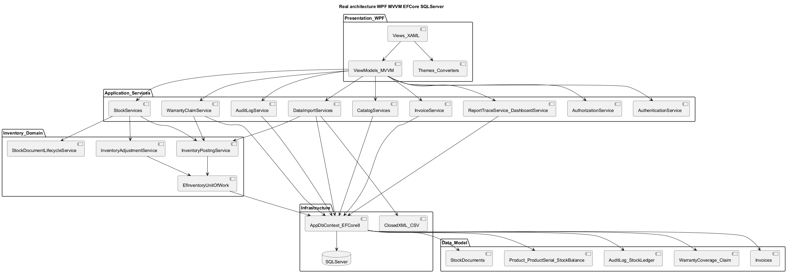
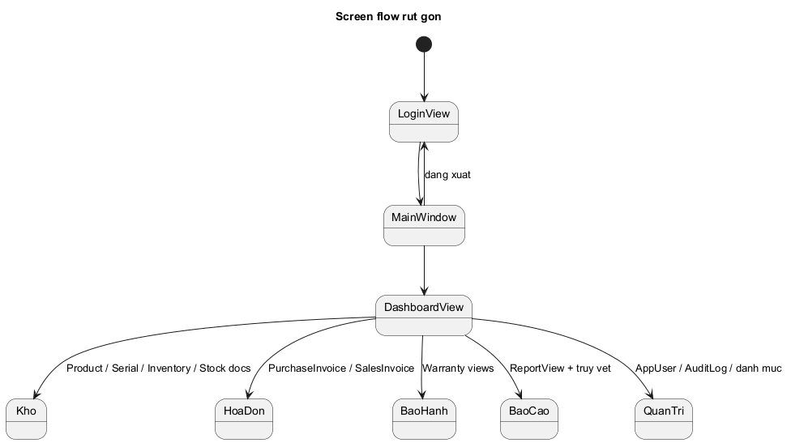
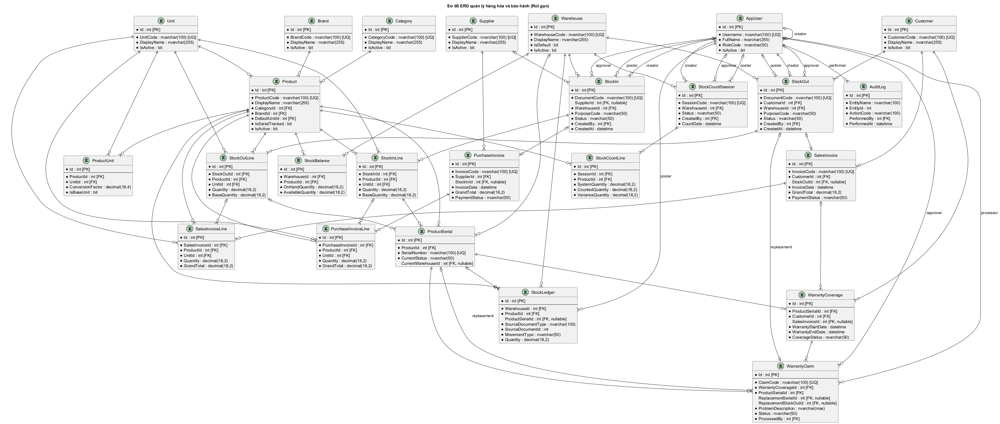
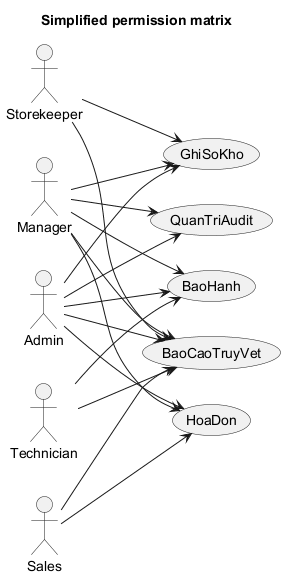

# WarePro

> Write-concurrency and shared SQL Server contract: [docs/DATABASE_CONCURRENCY.md](docs/DATABASE_CONCURRENCY.md).

WarePro là ứng dụng quản lý kho, hàng hóa và bảo hành dành cho Windows. Phần mềm chạy trên các máy client; dữ liệu dùng chung được lưu trong SQL Server trung tâm và truy cập qua mạng LAN.

## Tính năng chính

- quản lý sản phẩm, đơn vị tính, thương hiệu, danh mục, khách hàng và nhà cung cấp;
- nhập kho, xuất kho, chuyển kho, kiểm kê và điều chỉnh tồn kho;
- quản lý serial, truy vết lịch sử hàng hóa và số lượng tồn;
- lập hóa đơn mua, hóa đơn bán và theo dõi thanh toán;
- tiếp nhận, xử lý và đổi sản phẩm bảo hành;
- nhập dữ liệu từ Excel/CSV, in chứng từ và xuất báo cáo;
- quản lý tài khoản, phân quyền theo vai trò và lưu nhật ký thao tác;
- kiểm tra, tải và xác minh bản cập nhật phần mềm.

## Kiến trúc

WarePro dùng mô hình desktop client–server:

1. mỗi máy client cài ứng dụng WarePro;
2. ứng dụng kết nối qua LAN tới một SQL Server trung tâm;
3. mọi client đọc và ghi trên cùng cơ sở dữ liệu;
4. SQL Server quản lý transaction, khóa, ràng buộc và tính nhất quán dữ liệu.

Trong ứng dụng, mã nguồn được tổ chức theo MVVM:

```text
WPF Views
    ↓ binding/command
ViewModels
    ↓ gọi nghiệp vụ
Services + Inventory domain
    ↓ Entity Framework Core
SQL Server trung tâm
```



## Công nghệ

- C# và .NET 8;
- WPF/XAML;
- MVVM với CommunityToolkit.Mvvm;
- Entity Framework Core 8;
- SQL Server và Microsoft.Data.SqlClient;
- Material Design cho giao diện;
- ClosedXML và CsvHelper cho Excel/CSV;
- LiveChartsCore cho biểu đồ;
- BCrypt.Net cho mật khẩu;
- xUnit, Moq và SQLite in-memory cho kiểm thử;
- Inno Setup cho bộ cài Windows.

## Cấu trúc repository

```text
.
├── QuanLyHangHoa/          # ứng dụng WPF chính
│   ├── Views/              # màn hình và cửa sổ XAML
│   ├── ViewModels/         # trạng thái, command và điều hướng
│   ├── Services/           # nghiệp vụ, dữ liệu, báo cáo, bảo hành
│   ├── Inventory/          # logic ghi sổ và tồn kho
│   ├── Models/             # mô hình dữ liệu
│   ├── Data/               # AppDbContext và ánh xạ EF Core
│   ├── Startup/            # kiểm tra hệ thống khi mở ứng dụng
│   └── Updates/            # kiểm tra và cài bản cập nhật
├── QuanLyHangHoa.Tests/    # kiểm thử tự động
├── WarePro.Core/           # cấu hình và thành phần dùng chung
├── WarePro.SetupHelper/    # hỗ trợ cấu hình SQL khi cài đặt
├── Database/               # seed và công cụ dữ liệu
├── installer/              # cấu hình bộ cài Inno Setup
├── Diagram/                # PlantUML, Mermaid, PNG và SVG
├── docs/                   # hướng dẫn người dùng và vận hành
└── scripts/                # script build, kiểm tra và phát hành
```

## Thiết kế phần mềm

### Phân lớp

- **View** chỉ hiển thị dữ liệu và chuyển thao tác người dùng thành command.
- **ViewModel** giữ trạng thái màn hình, kiểm tra quyền truy cập và gọi service.
- **Service** thực hiện nghiệp vụ, xác thực lại quyền và mở transaction khi cần.
- **Inventory domain** tập trung quy tắc nhập, xuất, chuyển, điều chỉnh và ghi sổ.
- **EF Core/SQL Server** lưu dữ liệu, áp dụng khóa ngoại, chỉ mục, unique constraint và concurrency token.

### Toàn vẹn dữ liệu

- các thao tác nghiệp vụ liên quan nhiều bảng được ghi trong cùng transaction;
- số lượng tồn, sổ kho, serial, trạng thái chứng từ và audit log được lưu cùng một lần;
- mỗi cặp kho–sản phẩm chỉ có một dòng `StockBalance`;
- các trường số lượng của `StockBalance` là optimistic concurrency token;
- nếu tồn kho đã bị client khác thay đổi, ứng dụng trả lỗi yêu cầu tải lại thay vì âm thầm ghi đè;
- các quy trình nhạy cảm dùng mức cô lập phù hợp và kiểm tra lại dữ liệu trước khi commit.

### Bảo mật và truy vết

- mật khẩu người dùng chỉ lưu dưới dạng BCrypt hash;
- quyền được kiểm tra ở giao diện và kiểm tra lại tại service;
- trạng thái tài khoản hoặc vai trò được đọc lại trước thao tác ghi quan trọng;
- nhật ký lưu người thực hiện, thời điểm, đối tượng và hành động.

## Diagram và luồng nghiệp vụ

### Luồng màn hình



### Mô hình dữ liệu



### Các luồng chính

- [đăng nhập và xác thực](Diagram/plantuml-png/AuthFlow_ChiTiet.png);
- [nhập kho và ghi sổ](Diagram/plantuml-png/Sequence_NhapKho_GhiSo.png);
- [xuất kho và ghi sổ](Diagram/plantuml-png/Sequence_XuatKho_GhiSo.png);
- [kiểm kê và điều chỉnh](Diagram/plantuml-png/Activity_KiemKe_DieuChinh.png);
- [nhập tồn đầu kỳ từ Excel/CSV](Diagram/plantuml-png/Activity_ImportTonDauKy_ExcelCsv.png);
- [bảo hành và đổi mới](Diagram/plantuml-png/Sequence_BaoHanh_DoiMoi.png);
- [vòng đời chứng từ kho](Diagram/plantuml-png/State_VongDoi_ChungTuKho.png);
- [vòng đời hồ sơ bảo hành](Diagram/plantuml-png/State_VongDoi_HoSoBaoHanh.png).

Toàn bộ nguồn PlantUML, bản PNG và SVG nằm trong [thư mục Diagram](Diagram/README.md).

## Các view thực tế

| Nhóm | View | Chức năng |
| --- | --- | --- |
| Tổng quan | [DashboardView](QuanLyHangHoa/Views/DashboardView.xaml) | chỉ số kho, bán hàng và bảo hành |
| Danh mục | [ProductView](QuanLyHangHoa/Views/ProductView.xaml) | sản phẩm và thông tin liên quan |
| Tồn kho | [InventoryView](QuanLyHangHoa/Views/InventoryView.xaml) | tồn theo sản phẩm và kho |
| Nhập kho | [StockInView](QuanLyHangHoa/Views/StockInView.xaml) | lập, duyệt và ghi sổ phiếu nhập |
| Xuất kho | [StockOutView](QuanLyHangHoa/Views/StockOutView.xaml) | lập, duyệt và ghi sổ phiếu xuất |
| Chuyển kho | [StockTransferView](QuanLyHangHoa/Views/StockTransferView.xaml) | chuyển hàng giữa các kho |
| Kiểm kê | [StockCountView](QuanLyHangHoa/Views/StockCountView.xaml) | kiểm đếm và tạo điều chỉnh |
| Bảo hành | [WarrantyView](QuanLyHangHoa/Views/WarrantyView.xaml) | tiếp nhận và xử lý hồ sơ bảo hành |
| Báo cáo | [ReportView](QuanLyHangHoa/Views/ReportView.xaml) | báo cáo tồn, nhập, xuất và bảo hành |
| Nhật ký | [AuditLogView](QuanLyHangHoa/Views/AuditLogView.xaml) | tra cứu lịch sử thao tác |
| Người dùng | [AppUserView](QuanLyHangHoa/Views/AppUserView.xaml) | tài khoản, trạng thái và vai trò |
| Cập nhật | [UpdateView](QuanLyHangHoa/Views/UpdateView.xaml) | kiểm tra và cài phiên bản mới |

## Thiết kế phân quyền

Quyền được ánh xạ tập trung trong `AuthorizationService`. Việc ẩn nút ở giao diện chỉ hỗ trợ trải nghiệm; service vẫn kiểm tra lại quyền trước khi thay đổi dữ liệu.

| Vai trò | Quyền chính |
| --- | --- |
| Quản trị viên | toàn bộ quyền, gồm quản lý người dùng |
| Quản lý | toàn bộ quyền trừ quản lý người dùng |
| Nhân viên kho | nhập kho, xuất kho, điều chỉnh tồn và xem báo cáo |
| Nhân viên bán hàng | lập hóa đơn bán và xem báo cáo |
| Nhân viên bảo hành | tạo hồ sơ bảo hành và xem báo cáo |



Máy client thông thường chỉ cần cài ứng dụng WarePro và cấu hình địa chỉ SQL Server. SQL Server chỉ cần cài trên máy chủ dữ liệu hoặc máy chạy độc lập.
