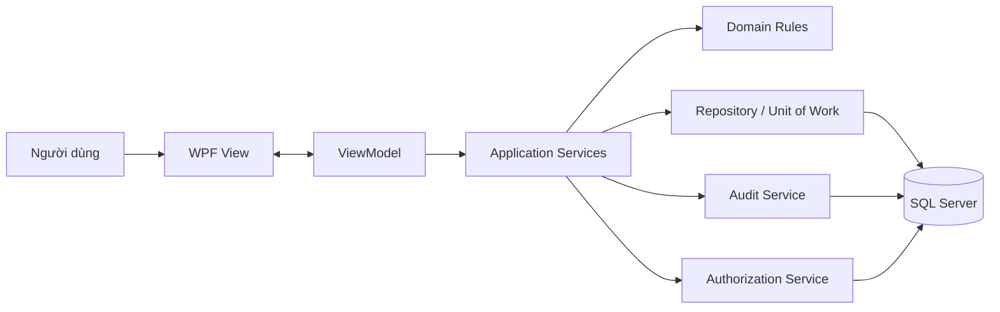
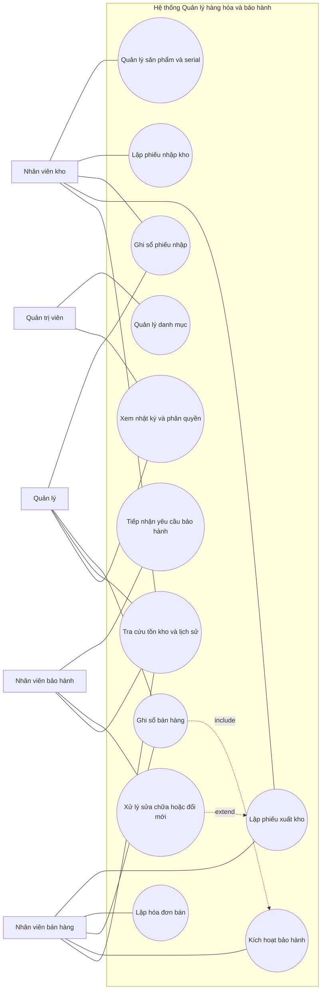
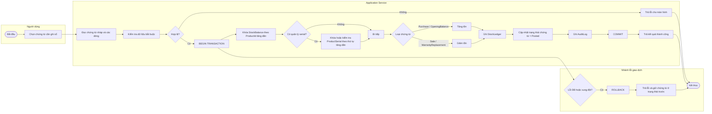
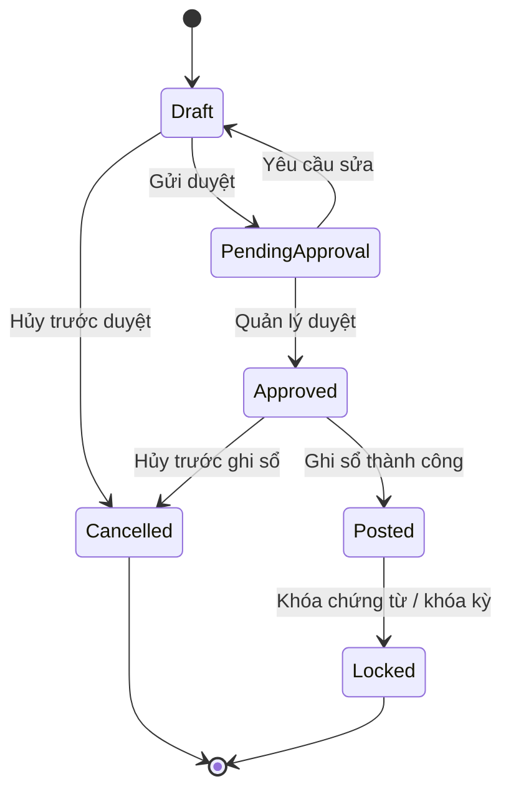
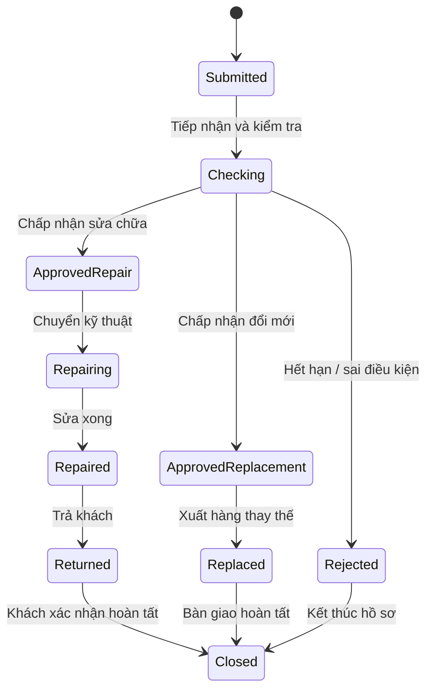
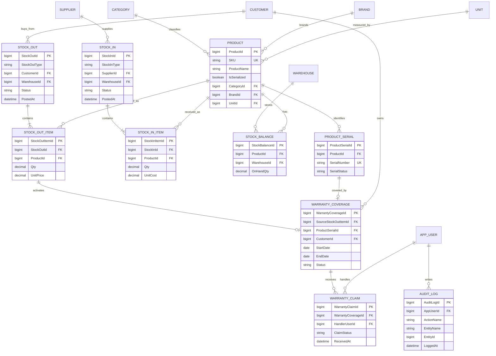

# Báo cáo định hướng phân tích và thiết kế WarePro

## Tóm tắt điều hành

Báo cáo này trình bày một bản thuyết minh định hướng theo phong cách đồ án tốt nghiệp cho **WarePro - phần mềm quản lý hàng hóa và bảo hành**, với mục tiêu đủ chặt chẽ để nộp giảng viên ở giai đoạn báo cáo, đồng thời đủ mở để phát triển thành đồ án chính thức về sau. Đề xuất kỹ thuật chọn mô hình **ứng dụng desktop nội bộ dùng WPF**, tổ chức theo **MVVM**, kết nối **SQL Server**. Lý do chọn như vậy là vì WPF có cơ chế **data binding** và **commanding** rất phù hợp cho ứng dụng dữ liệu; MVVM giúp tách giao diện khỏi logic trình bày, tăng khả năng kiểm thử và giảm phụ thuộc giữa view với logic; còn SQL Server là hệ quản trị CSDL giao dịch có cơ chế khóa, phiên bản hóa và xử lý giao dịch phù hợp cho môi trường nhiều người dùng thao tác đồng thời. citeturn10view1turn10view2turn13view0turn13view1turn9search0turn10view3

Về mô hình hóa, báo cáo dùng **UML 2.5.1** làm nền tảng khái niệm vì đây là đặc tả chuẩn cho ngôn ngữ mô hình hóa dùng để biểu diễn, đặc tả, xây dựng và tài liệu hóa hệ thống phần mềm. Theo đúng vai trò của từng loại sơ đồ, Use Case được dùng để chốt phạm vi chức năng từ góc nhìn người dùng; Sequence để mô tả tương tác theo thời gian; Activity để mô tả workflow nghiệp vụ; State để mô tả vòng đời đối tượng; còn ERD để chốt cấu trúc dữ liệu logic. citeturn10view0turn11view6turn11view5turn10view13turn10view14turn10view15

Trong phiên làm việc hiện tại, không có tệp tải lên nào ở trạng thái truy xuất được bằng công cụ tra cứu tệp; vì vậy báo cáo này ưu tiên các nguồn chuẩn chính thức và hướng dẫn gốc của Microsoft, OMG, IBM, Mermaid và Visual Paradigm, đồng thời nêu rõ các **giả định thiết kế** ở những điểm mà đề bài chưa cung cấp ràng buộc chi tiết.

Bố cục khuyến nghị để in trong **10–12 trang** như sau:

| Phần | Độ dài gợi ý |
|---|---:|
| Tóm tắt điều hành | 0.5 trang |
| Phạm vi, phương pháp, giả định | 1 trang |
| Đặc tả yêu cầu hệ thống | 2 trang |
| Thiết kế phần mềm và kiến trúc | 2 trang |
| UML và ERD | 4–4.5 trang |
| Phân tích luồng nghiệp vụ trọng yếu | 1.5–2 trang |
| Kết luận | 0.5 trang |

## Phạm vi, phương pháp và giả định thiết kế

Báo cáo được viết theo hướng **đặc tả phân tích – thiết kế** chứ chưa phải hồ sơ triển khai. Vì vậy, trọng tâm không nằm ở mã nguồn mà nằm ở bốn lớp nội dung: yêu cầu hệ thống, thiết kế phần mềm, kiến trúc phần mềm và mô hình hóa nghiệp vụ. Cách tiếp cận này phù hợp với tinh thần của UML: dùng mô hình để làm rõ **hệ thống cần làm gì**, **thành phần nào chịu trách nhiệm gì**, và **dữ liệu chuyển động ra sao** trước khi đi vào hiện thực hóa. citeturn10view0turn10view12turn11view4turn11view5

Về công cụ dựng hình, có thể dùng **Visual Paradigm** khi cần sơ đồ UML đúng ký pháp tương tác, hoặc dùng **Mermaid Live Editor** khi cần chèn nhanh vào tài liệu Markdown và xuất hình phục vụ báo cáo. Tài liệu Mermaid hiện hỗ trợ rõ ràng các loại sơ đồ như **flowchart, sequence, state, ERD** và có Live Editor để luyện cú pháp và render; ngược lại, danh mục cú pháp hiện hành không liệt kê **Use Case** hay **Activity Diagram** như các kiểu sơ đồ riêng. Vì vậy, trong báo cáo này, **Use Case** và **Activity** được biểu diễn bằng **flowchart mô phỏng**, còn **Sequence**, **State** và **ERD** dùng đúng cú pháp Mermaid gốc. Đây là một suy luận trực tiếp từ danh mục sơ đồ được Mermaid công bố. citeturn12view1turn12view3turn15view0turn10view9turn10view10turn10view11turn14view0

Các giả định thiết kế được dùng thống nhất trong toàn báo cáo:

| Hạng mục | Giả định dùng trong báo cáo |
|---|---|
| Môi trường triển khai | Ứng dụng desktop nội bộ cho doanh nghiệp nhỏ hoặc vừa |
| Mô hình kho | Một kho mặc định ở giai đoạn đầu; thiết kế không khóa khả năng mở rộng đa kho |
| Quản lý hàng hóa | Hỗ trợ cả hàng không quản lý serial và hàng quản lý serial |
| Hóa đơn | Tách logic chứng từ kho và logic hóa đơn thương mại, nhưng cho phép liên kết chéo |
| Thanh toán | Chưa triển khai pha nhiều lần thanh toán hoặc công nợ chi tiết |
| Bảo hành | Bảo hành được kích hoạt khi nghiệp vụ bán hàng được ghi sổ thành công |
| Phân quyền | Phân quyền theo `RoleCode` cố định: Quản trị viên, Quản lý, Kho, Bán hàng, Bảo hành |
| Nhật ký | Có `AuditLog` ở cấp ứng dụng cho các thao tác nhạy cảm |

Bản đồ module ở mức logic được đề xuất như sau:

| Module | Mục tiêu | Kết quả nghiệp vụ chính |
|---|---|---|
| Danh mục nền | Chuẩn hóa dữ liệu dùng chung | Mặt hàng, nhóm hàng, thương hiệu, đơn vị, khách hàng, nhà cung cấp, kho |
| Kho | Quản lý nhập, xuất, tồn và ledger | Cập nhật `StockBalance`, lịch sử `StockLedger`, trạng thái serial |
| Bán hàng | Lập hóa đơn và xuất bán | Doanh số, giảm tồn, sinh bảo hành |
| Bảo hành | Tiếp nhận và xử lý yêu cầu bảo hành | Kiểm tra hiệu lực, sửa chữa, đổi mới, kết thúc hồ sơ |
| Quản trị | Người dùng, phân quyền, audit | Kiểm soát truy cập, truy vết thao tác |

## Đặc tả yêu cầu hệ thống

Từ góc nhìn giảng viên, phần yêu cầu phải trả lời được hai câu hỏi: **hệ thống phục vụ ai** và **hệ thống phải làm được gì**. Theo đúng tinh thần use case, yêu cầu chức năng nên được viết từ góc nhìn mục tiêu của người dùng thay vì từ góc nhìn kỹ thuật cài đặt. Use case mô tả **“cái gì”** hệ thống phải cung cấp, chứ không mô tả chi tiết **“làm bằng cách nào”**. citeturn10view12turn11view6turn11view7

Các tác nhân chính được xác định như sau:

| Tác nhân | Trách nhiệm chính |
|---|---|
| Quản trị viên | Quản lý danh mục, người dùng, phân quyền, cấu hình hệ thống, xem nhật ký |
| Quản lý | Duyệt hoặc kiểm soát ghi sổ, xem báo cáo tổng hợp, giám sát ngoại lệ |
| Nhân viên kho | Lập phiếu nhập/xuất, kiểm kê, cập nhật serial, tra cứu tồn |
| Nhân viên bán hàng | Lập hóa đơn bán, tạo chứng từ xuất, tra cứu tồn và lịch sử bán |
| Nhân viên bảo hành | Tiếp nhận yêu cầu bảo hành, xử lý sửa chữa hoặc đổi mới, đóng hồ sơ |

Các **yêu cầu chức năng** cốt lõi có thể chốt thành bảng sau:

| Nhóm chức năng | Nội dung yêu cầu |
|---|---|
| Quản lý danh mục | Tạo/sửa/xóa mặt hàng, nhóm hàng, thương hiệu, đơn vị, khách hàng, nhà cung cấp, kho |
| Quản lý sản phẩm | Khai báo sản phẩm có hoặc không có serial; cấu hình thời hạn bảo hành mặc định |
| Nhập kho | Lập phiếu nhập từ mua hàng hoặc nhập tồn đầu kỳ (`OpeningBalance`) |
| Xuất kho | Lập phiếu xuất cho bán hàng và thay thế bảo hành |
| Tồn kho | Tra cứu tồn tức thời theo mặt hàng/kho; xem lịch sử biến động |
| Hóa đơn bán | Lập hóa đơn bán, liên kết với chứng từ xuất kho |
| Kích hoạt bảo hành | Tự sinh hiệu lực bảo hành khi bán thành công |
| Khiếu nại bảo hành | Tiếp nhận, kiểm tra, sửa chữa, từ chối hoặc đổi mới |
| Nhật ký và truy vết | Ghi nhận thao tác nhạy cảm: ghi sổ, hủy, đổi trạng thái, phân quyền |

Ngoài chức năng, hệ thống cần các **yêu cầu phi chức năng** có tính ràng buộc thiết kế. Với hệ thống tồn kho, mọi thao tác làm thay đổi số lượng phải được đặt trong giao dịch; SQL Server cho biết việc dùng transaction không hiệu quả sẽ gây tranh chấp trong hệ thống nhiều người dùng, còn `BEGIN TRANSACTION` giữ tài nguyên khóa đến khi `COMMIT` hoặc `ROLLBACK`, và transaction kéo dài có thể làm tăng block các phiên khác. Mặc định `READ COMMITTED` ngăn dirty read; còn mức cô lập cao hơn như `REPEATABLE READ` hoặc `SERIALIZABLE` giảm tính đồng thời vì giữ khóa lâu hơn. Về bảo mật, mô hình **role-based security** cho phép quyết định quyền theo vai trò thay vì cá nhân; còn về kiểm toán, log nên ghi **user context** và các sự kiện quan trọng, đồng thời SQL Server Audit có thể được bật để ghi nhận hành động ở cấp database/server nếu cần truy vết mạnh hơn. citeturn10view3turn16view0turn16view1turn17view0turn16view3turn10view7turn18view0turn10view5turn10view6

Từ đó, bộ yêu cầu phi chức năng của báo cáo được đề xuất như sau:

| Nhóm phi chức năng | Yêu cầu đề xuất |
|---|---|
| Tính đúng đắn dữ liệu | Mọi cập nhật tồn phải nằm trong một transaction nguyên tử |
| Đồng thời | Phải có chiến lược khóa thống nhất để giảm deadlock |
| Hiệu năng | Ưu tiên transaction ngắn, chỉ khóa hàng cần thiết, tránh đọc – sửa – ghi kéo dài |
| Kiểm thử | ViewModel và dịch vụ nghiệp vụ phải kiểm thử được độc lập với UI |
| Phân quyền | Chức năng được mở theo vai trò, tránh gán quyền rời rạc theo từng cá nhân |
| Audit | Có nhật ký cho người thao tác, sự kiện, thời điểm, dữ liệu trước/sau nếu là thao tác nhạy cảm |
| Mở rộng | Không khóa kiến trúc vào một kho, một kênh bán, một loại giao diện |

## Thiết kế phần mềm và kiến trúc hệ thống

Cấu trúc phần mềm nên được tách thành bốn lớp logic: **Presentation**, **Application Services**, **Domain**, và **Infrastructure**. Lựa chọn này phù hợp với WPF/MVVM: View thực hiện hiển thị; ViewModel cung cấp trạng thái và lệnh cho giao diện; mô hình miền giữ dữ liệu và quy tắc; dịch vụ và repository xử lý điều phối, lưu trữ và transaction. WPF hỗ trợ data binding để đồng bộ trạng thái hiển thị với dữ liệu, còn commanding giúp đưa thao tác người dùng về lớp lệnh có nghĩa nghiệp vụ hơn là xử lý trực tiếp ở code-behind. MVVM đồng thời hỗ trợ kiểm thử tốt hơn vì ViewModel có thể được kiểm tra mà không cần UI thật. citeturn10view1turn10view2turn13view0turn13view1

Hình đề xuất 1. Kiến trúc tổng thể hệ thống.



Trong kiến trúc trên, **View** chỉ chịu trách nhiệm hiển thị; **ViewModel** gom trạng thái màn hình, lệnh và validate mức giao diện; **Application Services** điều phối từng use case như “Ghi sổ phiếu nhập”, “Ghi sổ bán hàng”, “Tạo hồ sơ bảo hành”; **Domain** chứa quy tắc như “không cho xuất âm kho”, “serial đã bán không thể bán lại”, “một hồ sơ bảo hành mở không được trùng serial”; còn **Infrastructure** hiện thực repository, transaction, audit và kết nối SQL Server. Cách chia này giữ được ranh giới rõ ràng giữa giao diện, nghiệp vụ và dữ liệu, phù hợp với nguyên tắc độc lập View–ViewModel mà tài liệu MVVM khuyến nghị. citeturn13view0turn13view1

Về transaction, thiết kế nên coi **ghi sổ** là ranh giới giao dịch. `BEGIN TRANSACTION` xác lập một điểm nhất quán; từ thời điểm đó đến trước `COMMIT`, các tài nguyên có thể bị khóa để bảo vệ mức cô lập; nếu lỗi phát sinh thì `ROLLBACK` đưa hệ thống trở về trạng thái nhất quán ban đầu và giải phóng tài nguyên của transaction. SQL Server cũng chỉ ra rằng deadlock xảy ra khi hai hay nhiều tác vụ khóa các tài nguyên theo thứ tự xung đột lẫn nhau. Vì vậy, trong hệ thống này cần áp dụng một **thứ tự khóa cố định**, ví dụ: khóa `StockBalance` theo `ProductId` tăng dần rồi mới khóa `ProductSerial` theo `ProductSerialId` tăng dần. Đây là một quyết định thiết kế nhằm giảm khả năng chờ vòng tròn. citeturn16view0turn16view1turn10view4turn10view3

Về mức cô lập, báo cáo đề xuất lấy **`READ COMMITTED`** làm mặc định vì đây là mức chuẩn của SQL Server để tránh dirty read. Nếu về sau hệ thống có khối lượng đọc báo cáo lớn, có thể cân nhắc **`READ_COMMITTED_SNAPSHOT`** hoặc **`SNAPSHOT`** ở giai đoạn triển khai, nhưng không nên nâng thẳng lên `SERIALIZABLE` cho mọi nghiệp vụ vì điều đó làm giảm tính đồng thời. Nói ngắn gọn, chiến lược hợp lý cho bài toán kho là: **transaction ngắn, câu lệnh UPDATE trực tiếp, thứ tự khóa ổn định, chỉ tăng isolation khi có lý do rõ ràng**. citeturn17view0turn16view3turn10view3

Về phân quyền, báo cáo khuyến nghị cơ chế **RBAC theo vai trò** vì tài liệu Microsoft cho thấy mô hình này giúp đơn giản hóa quản trị truy cập và ra quyết định ủy quyền theo role thay vì theo từng cá nhân. Về audit, cần tách hai mức: **AuditLog cấp ứng dụng** để ghi các thao tác nghiệp vụ như ghi sổ, đổi trạng thái, từ chối bảo hành; và **SQL Server Audit** như một lớp bổ sung cho các yêu cầu kiểm soát mạnh hơn ở cấp CSDL. Thiết kế log nên luôn chứa ngữ cảnh người dùng và các sự kiện quan trọng. citeturn10view7turn18view0turn10view5turn10view6

## Mô hình hóa hệ thống bằng UML và ERD

Về mặt học thuật, một báo cáo tốt không nên chỉ “có sơ đồ”, mà phải dùng mỗi sơ đồ đúng chỗ. Use Case để chốt phạm vi chức năng; Sequence để làm rõ trách nhiệm giữa các lớp; Activity để mô tả đường đi nghiệp vụ và các nhánh; State để chốt vòng đời; ERD để khóa mô hình dữ liệu. Cách dùng này thống nhất với các hướng dẫn UML của IBM và Visual Paradigm. citeturn11view4turn11view5turn10view12turn10view13turn10view14turn10view15

Để báo cáo in ra 10–12 trang vẫn dễ đọc, nên đặt các hình như sau:

| Hình | Nội dung | Vị trí gợi ý trong bản in |
|---|---|---|
| Hình 1 | Kiến trúc tổng thể | Cuối phần kiến trúc |
| Hình 2 | Use Case tổng quát | Đầu phần UML |
| Hình 3 | Sequence nhập kho | Nửa trên trang UML tiếp theo |
| Hình 4 | Sequence bán hàng – bảo hành | Nửa dưới cùng trang hoặc đầu trang sau |
| Hình 5 | Activity ghi sổ và cập nhật tồn | Giữa phần UML |
| Hình 6 | State chứng từ kho | Sau Activity |
| Hình 7 | State vòng đời bảo hành | Sau State chứng từ |
| Hình 8 | ERD rút gọn | Cuối phần UML, liền trước bảng thực thể |

**Hình đề xuất 2. Use Case tổng quát của hệ thống**



Sơ đồ này dùng để khóa **phạm vi chức năng** và **tác nhân**. Điểm quan trọng cần giải thích với giảng viên là quan hệ **`include`** giữa “Ghi sổ bán hàng” và “Kích hoạt bảo hành”: nghĩa là khi bán hàng hoàn tất và đủ điều kiện, hệ thống bắt buộc sinh hiệu lực bảo hành. Quan hệ **`extend`** từ “Xử lý sửa chữa hoặc đổi mới” sang “Lập phiếu xuất kho” diễn giải nhánh nghiệp vụ đặc biệt: chỉ khi quyết định đổi mới thì mới phát sinh một xuất kho thay thế. Theo hướng dẫn Use Case, sơ đồ này chỉ nên biểu diễn **mục tiêu nghiệp vụ**, không kéo các thao tác kỹ thuật như khóa bản ghi hay ghi log vào cùng mức. Trong Visual Paradigm, nên vẽ biên hệ thống trước, sau đó đặt actor bên ngoài, nhóm các use case theo module, và chỉ dùng `include/extend` khi quan hệ thực sự ổn định. Với Mermaid, vì không có Use Case nguyên bản, cách hợp lý nhất là mô phỏng bằng flowchart và subgraph biên hệ thống. citeturn10view12turn11view6turn19search0turn12view1turn12view3turn15view0turn14view0

**Hình đề xuất 3. Sequence của nghiệp vụ ghi sổ nhập kho Purchase hoặc OpeningBalance**

```mermaid
sequenceDiagram
    autonumber
    actor K as Nhân viên kho
    participant UI as WPF UI
    participant IS as InventoryService
    participant RP as Repository/UoW
    database DB as SQL Server

    K->>UI: Nhấn "Ghi sổ phiếu nhập"
    UI->>IS: PostStockIn(stockInId)
    IS->>RP: Load Draft + Items
    RP->>DB: SELECT StockIn, StockInItem
    DB-->>RP: Dữ liệu chứng từ
    RP-->>IS: Draft document
    IS->>IS: Kiểm tra dữ liệu, kho, số lượng, serial

    alt Không hợp lệ
        IS-->>UI: Trả thông báo lỗi
    else Hợp lệ
        IS->>DB: BEGIN TRANSACTION
        IS->>DB: Lock StockBalance theo ProductId ASC
        alt Hàng có serial
            IS->>DB: Kiểm tra trùng SerialNumber
            IS->>DB: INSERT ProductSerial(Status=InStock)
        end

        alt Loại = Purchase
            IS->>DB: UPDATE StockBalance (+Qty)
        else Loại = OpeningBalance
            IS->>DB: UPDATE StockBalance (+Qty mở đầu kỳ)
        end

        IS->>DB: INSERT StockLedger
        IS->>DB: UPDATE StockIn(Status=Posted)
        IS->>DB: INSERT AuditLog
        IS->>DB: COMMIT
        IS-->>UI: Ghi sổ thành công
    end
```

Sequence này làm rõ **ai gọi ai**, **dịch vụ nào chịu trách nhiệm**, và **transaction bắt đầu ở đâu**. Theo hướng dẫn về sequence diagram, giá trị lớn nhất của sơ đồ là phơi bày đường đi qua các lifeline theo trục thời gian. Trong use case này, validation mức nghiệp vụ diễn ra trước transaction; transaction chỉ mở khi hệ thống đã đủ điều kiện ghi sổ; còn cập nhật tồn, serial, ledger và audit phải cùng nằm trong một đơn vị công việc nguyên tử. Khi tự vẽ sơ đồ này, nên bắt đầu từ một use case đã ổn định, liệt kê đúng các participant có trách nhiệm, đặt `BEGIN/COMMIT/ROLLBACK` thành thông điệp rõ ràng, và dùng `alt` cho các nhánh Purchase/OpeningBalance hoặc có/không có serial. citeturn10view13turn11view1turn16view0turn16view1turn10view3

**Hình đề xuất 4. Sequence của bán hàng và kích hoạt WarrantyCoverage**

```mermaid
sequenceDiagram
    autonumber
    actor S as Nhân viên bán hàng
    participant UI as WPF UI
    participant SS as SalesService
    participant WS as WarrantyService
    database DB as SQL Server

    S->>UI: Nhấn "Ghi sổ bán hàng"
    UI->>SS: PostSale(stockOutId, saleInvoiceId)
    SS->>DB: Đọc chứng từ nháp + kiểm tra tồn khả dụng
    SS->>SS: Validate khách hàng, serial, số lượng

    alt Không đủ điều kiện
        SS-->>UI: Báo lỗi và không ghi sổ
    else Hợp lệ
        SS->>DB: BEGIN TRANSACTION
        SS->>DB: Lock StockBalance theo ProductId ASC
        SS->>DB: Lock ProductSerial theo ProductSerialId ASC
        SS->>DB: UPDATE StockBalance (-Qty)
        SS->>DB: UPDATE ProductSerial(Status=Sold)
        SS->>DB: UPDATE SaleInvoice(Status=Posted)
        SS->>DB: UPDATE StockOut(Status=Posted)
        SS->>WS: CreateCoverageFromSale(...)
        WS->>DB: INSERT WarrantyCoverage(Status=Active)
        SS->>DB: INSERT StockLedger
        SS->>DB: INSERT AuditLog
        SS->>DB: COMMIT
        SS-->>UI: Bán hàng thành công và bảo hành đã kích hoạt
    end
```

Sơ đồ này biểu diễn luồng quan trọng nhất của hệ thống vì nó nối ba mảng: **bán hàng – tồn kho – bảo hành**. Điểm cần nhấn mạnh trong phần thuyết minh là `WarrantyCoverage` phải được sinh **trong cùng transaction** với nghiệp vụ bán hàng; nếu không, hệ thống có thể rơi vào trạng thái bán hàng thành công nhưng bảo hành chưa kích hoạt. Khi vẽ, nên giữ nguyên tắc: participant đủ ít để đọc được, nhưng đủ nhiều để thể hiện đúng ranh giới trách nhiệm; thông điệp phải theo đúng ngôn ngữ nghiệp vụ; các điểm khóa và commit phải hiện ra rõ nếu use case liên quan đến tồn kho. Mermaid hỗ trợ sequence diagram nguyên bản; nếu cần hình đẹp để chèn Word/PDF, chỉ cần dán khối vào Mermaid Live Editor để export ảnh. citeturn10view9turn10view13turn10view3turn14view0

**Hình đề xuất 5. Activity của luồng ghi sổ và cập nhật StockBalance**



Về bản chất UML, activity diagram dùng để mô tả **workflow**, nhánh rẽ, đồng thời và luồng điều khiển trong một quy trình; IBM và Visual Paradigm đều dùng nó cho business workflow hoặc flow of events của use case. Vì Mermaid hiện không có **activity diagram** như một kiểu cú pháp riêng trong danh mục công bố, sơ đồ trên được mô phỏng bằng **flowchart**, dùng node quyết định, node bắt đầu/kết thúc và `subgraph` để thay cho các “lane” trách nhiệm. Khi tự vẽ, nên chọn **một quy trình cụ thể**, xác định rõ điểm bắt đầu – kết thúc, các quyết định, nhánh lỗi, và ranh giới transaction; nếu thêm quá nhiều detail kỹ thuật sẽ làm sơ đồ bị nặng và khó chấm. citeturn11view5turn11view0turn12view1turn12view3turn15view0

**Hình đề xuất 6. State của chứng từ kho**



State diagram được dùng cho **một đối tượng có vòng đời**, không phải cho cả hệ thống. Với chứng từ kho, trạng thái quan trọng nhất nằm ở các điểm: nháp, chờ duyệt, đã duyệt, đã ghi sổ, đã khóa. Hình này có ý nghĩa thiết kế mạnh vì nó ngăn việc “xử lý tùy tiện”: chẳng hạn chứng từ đã `Posted` thì không còn được sửa số lượng trực tiếp; nếu muốn đảo nghiệp vụ phải đi theo quy trình điều chỉnh hoặc chứng từ đối ứng. Theo định nghĩa state diagram, các thành phần cốt lõi là **state, transition, event, activity**, và sơ đồ này đặc biệt hữu ích khi mô hình hóa các đối tượng phản ứng theo trạng thái. Khi vẽ, hãy chọn đúng **một chủ thể** và chỉ giữ các trạng thái có ý nghĩa quản trị. citeturn10view14turn11view2

**Hình đề xuất 7. State của vòng đời WarrantyClaim**



Với hồ sơ bảo hành, state diagram quan trọng hơn activity vì đối tượng này **đổi hành vi theo trạng thái**: hồ sơ ở `Checking` có thể bị từ chối hoặc được duyệt; hồ sơ đã `Closed` thì không được quay về `Repairing`; hồ sơ vào nhánh `ApprovedReplacement` sẽ dẫn tới xuất kho thay thế thay vì sửa chữa. Đây chính là chỗ giáo viên thường nhìn để đánh giá nhóm có hiểu “vòng đời thực thể” hay không. Cách vẽ tốt nhất là liệt kê trạng thái trước, sau đó mới xác định trigger chuyển trạng thái, tránh vẽ theo cảm giác. citeturn10view14turn11view2

**Hình đề xuất 8. ERD rút gọn lõi nghiệp vụ**



Do giới hạn 10–12 trang, ERD trong thân báo cáo nên là **ERD rút gọn** để người chấm đọc được ngay mối quan hệ lõi: sản phẩm – serial – chứng từ kho – tồn – bảo hành – khiếu nại – audit. Mermaid ERD dùng **crow’s foot notation** để biểu diễn lực lượng quan hệ, rất phù hợp với báo cáo mức logic; còn nếu cần bản đầy đủ cho đồ án chính thức, có thể tách thêm `SaleInvoice`, `PurchaseInvoice`, `InvoiceItem`, `StockLedger`, `AppRole`, `Permission` sang phụ lục. Khi tự dựng ERD, nên chốt trước **mục đích** và **phạm vi mô hình**, sau đó mới thêm thực thể, thuộc tính, PK/FK và cardinality; nếu chưa rõ phạm vi, ERD sẽ rất dễ phình to và rối. citeturn10view11turn10view15turn11view3turn14view0

Bảng đặc tả nhanh các thực thể và ràng buộc chính:

| Thực thể | PK | FK chính | Unique / ràng buộc nổi bật |
|---|---|---|---|
| `Product` | `ProductId` | `CategoryId`, `BrandId`, `UnitId` | `SKU` duy nhất |
| `ProductSerial` | `ProductSerialId` | `ProductId` | `SerialNumber` duy nhất |
| `StockBalance` | `StockBalanceId` | `ProductId`, `WarehouseId` | duy nhất theo cặp `(ProductId, WarehouseId)` |
| `StockIn` | `StockInId` | `SupplierId`, `WarehouseId` | `StockInType` thuộc tập `Purchase`, `OpeningBalance` |
| `StockOut` | `StockOutId` | `CustomerId`, `WarehouseId` | `StockOutType` thuộc tập `Sale`, `WarrantyReplacement` |
| `WarrantyCoverage` | `WarrantyCoverageId` | `SourceStockOutItemId`, `ProductSerialId`, `CustomerId` | không được có coverage `Active` trùng nguồn/serial theo quy tắc hệ thống |
| `WarrantyClaim` | `WarrantyClaimId` | `WarrantyCoverageId`, `HandlerUserId` | tại một thời điểm chỉ nên có một claim mở cho một coverage |
| `AuditLog` | `AuditLogId` | `AppUserId` | bắt buộc có user, action, entity và timestamp |

## Phân tích các luồng nghiệp vụ trọng yếu

Để phần thiết kế không dừng ở mức “vẽ cho có”, cần nối các sơ đồ với các luồng nghiệp vụ thật. Bảng sau cho thấy cách ánh xạ giữa luồng nghiệp vụ và các sơ đồ đã dựng:

| Luồng | Use Case | Sequence | Activity | State | ERD liên quan |
|---|---|---|---|---|---|
| Nhập kho Purchase / OpeningBalance | UC3, UC4 | Hình 3 | Hình 5 | Hình 6 | `StockIn`, `StockInItem`, `StockBalance`, `ProductSerial` |
| Bán hàng và sinh bảo hành | UC5, UC6, UC7, UC8 | Hình 4 | Hình 5 | Hình 6 | `StockOut`, `StockOutItem`, `StockBalance`, `WarrantyCoverage` |
| Vòng đời khiếu nại bảo hành | UC9, UC10 | Có thể mở rộng ở đồ án chính thức | Bổ sung tùy nhu cầu | Hình 7 | `WarrantyCoverage`, `WarrantyClaim`, `AuditLog` |
| Cập nhật tồn và khóa đồng thời | UC4, UC7, UC10 | Hình 3, Hình 4 | Hình 5 | Hình 6 | `StockBalance`, `ProductSerial`, `StockLedger` |

**Luồng nhập kho Purchase / OpeningBalance.**  
Bước đầu là tạo chứng từ nháp; sau đó người dùng nhập dòng hàng, số lượng và thông tin serial nếu có. Hệ thống kiểm tra dữ liệu bắt buộc. Với `Purchase`, cần nhà cung cấp; với `OpeningBalance`, có thể bỏ qua nhà cung cấp nhưng phải bị ràng buộc theo kỳ khởi tạo dữ liệu. Khi người dùng ghi sổ, hệ thống mở transaction, khóa các dòng `StockBalance` liên quan, kiểm tra serial trùng nếu mặt hàng có quản lý serial, cộng tồn và ghi lịch sử. Sau `COMMIT`, trạng thái chứng từ chuyển sang `Posted`. Điểm cần nhấn mạnh trong báo cáo là **`OpeningBalance` là một nghiệp vụ đặc biệt của nhập kho**, nhưng không nên nhập lẫn sang luồng mua hàng thực tế vì ý nghĩa kế toán và truy vết khác nhau. Đây là lý do báo cáo dùng `StockInType` để phân biệt.

**Luồng bán hàng và sinh WarrantyCoverage.**  
Người bán lập hóa đơn và chứng từ xuất tương ứng, chọn khách hàng và sản phẩm. Ở bước ghi sổ, hệ thống kiểm tra tồn khả dụng hoặc trạng thái serial; transaction chỉ được mở khi dữ liệu đầu vào đã sạch. Khi transaction bắt đầu, hệ thống khóa `StockBalance`, khóa các serial cần bán, trừ tồn, đổi trạng thái serial sang `Sold`, cập nhật chứng từ/hóa đơn và sinh `WarrantyCoverage`. Điểm học thuật quan trọng là **gói sale + stock-out + warranty trong cùng một đơn vị công việc**, vì nếu tách rời sẽ làm hỏng tính nhất quán nghiệp vụ: khách đã mua hàng nhưng bảo hành chưa được kích hoạt.

**Luồng vòng đời WarrantyClaim.**  
Khi tiếp nhận yêu cầu bảo hành, hệ thống phải quy về một `WarrantyCoverage` cụ thể rồi mới cho tạo `WarrantyClaim`. Ở bước `Checking`, hệ thống xác minh ba điểm: còn hiệu lực hay không, serial/nguồn bán có hợp lệ hay không, và có claim đang mở trước đó hay không. Nếu từ chối, hồ sơ đi vào nhánh `Rejected`; nếu chấp nhận sửa chữa, hồ sơ chuyển `Repairing`; nếu chấp nhận đổi mới, hệ thống sau đó sẽ phát sinh nghiệp vụ xuất hàng thay thế và đưa trạng thái sang `Replaced`. Chính vì sự rẽ nhánh này mà **state diagram** của bảo hành phải tách thành line rõ ràng, không gom chung tất cả vào một chuỗi trạng thái tuyến tính.

**Luồng cập nhật `StockBalance` và khóa đồng thời.**  
Đây là điểm mà giáo viên thường hỏi sâu nhất. SQL Server cho biết transaction quản lý kém sẽ gây contention; transaction kéo dài sẽ giữ khóa lâu; deadlock xuất hiện khi các tác vụ chờ nhau trên tài nguyên bị khóa; còn mức cô lập càng cao thì lượng đồng thời thường càng giảm. Từ đó, thiết kế hợp lý cho đồ án này là: đọc và validate trước, chỉ mở transaction ở thời điểm sát ghi sổ; khóa theo thứ tự cố định; cập nhật tồn bằng các thao tác ghi trực tiếp thay vì vòng lặp đọc-sửa-ghi kéo dài; rollback toàn bộ khi bất kỳ phần nào thất bại; và luôn ghi audit cho thao tác hoàn tất hoặc lỗi đáng chú ý. citeturn10view3turn10view4turn16view0turn16view1turn17view0turn16view3

## Kết luận và hướng phát triển

Với phạm vi của một báo cáo định hướng nộp giảng viên, bản thuyết minh này đã làm rõ được các phần quan trọng nhất của một đồ án phần mềm: **bối cảnh và giả định**, **yêu cầu chức năng – phi chức năng**, **thiết kế phần mềm**, **kiến trúc hệ thống**, **mô hình UML**, **ERD**, và **phân tích các luồng nghiệp vụ trọng yếu**. Điểm mạnh của cấu trúc đề xuất là nó không dừng lại ở mô tả giao diện hay danh sách chức năng, mà đã đưa transaction, deadlock, phân quyền, audit và vòng đời thực thể vào đúng chỗ trong thiết kế.

Nếu phát triển thành đồ án tốt nghiệp chính thức, các hướng mở rộng hợp lý nhất là: mở rộng mô hình đa kho; thêm công nợ và thanh toán nhiều lần; bổ sung `StockLedger` đầy đủ cho đối soát lịch sử; chuẩn hóa hơn phần vai trò – quyền; tách dịch vụ nghiệp vụ thành Web API để phục vụ web/mobile; và bổ sung phần kiểm thử nghiệp vụ theo từng use case. Khi đó, bản báo cáo hiện tại có thể được giữ như **khung phân tích – thiết kế chuẩn**, sau đó mở rộng dần về triển khai, kiểm thử và đánh giá.

## Tài liệu tham khảo chọn lọc

- **OMG UML 2.5.1** – đặc tả chuẩn của UML làm cơ sở khái niệm cho báo cáo. citeturn10view0
- **Microsoft Learn** – WPF Data Binding, WPF Commanding, MVVM, SQL Server Locking/Deadlocks/Isolation/Audit và Role-Based Security. citeturn10view1turn10view2turn13view0turn13view1turn10view3turn10view4turn17view0turn10view5turn10view6turn10view7turn18view0
- **Mermaid Documentation** – cú pháp flowchart, sequence, state, ERD và Mermaid Live Editor để render hình. citeturn12view1turn12view3turn15view0turn10view9turn10view10turn10view11turn14view0
- **IBM UML Modeling Guides** – vai trò của use case, activity và behavior modeling trong phân tích hệ thống. citeturn11view4turn11view5turn11view6
- **Visual Paradigm Guides** – mục đích và cách dựng Use Case, Sequence, Activity, State Machine, ERD ở mức thực hành. citeturn10view12turn10view13turn10view14turn10view15turn19search0turn11view1turn11view0turn11view2turn11view3
