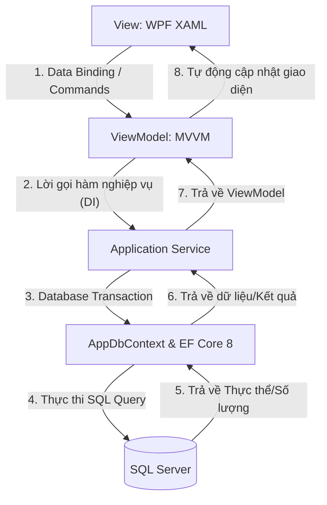

# Phân tích Chi tiết: Luồng Thực thi & Luồng Dữ liệu (Execution & Data Flows)

Tài liệu này cung cấp cái nhìn chi tiết và chuyên sâu nhất về cách thức hoạt động của hệ thống quản lý hàng hóa và bảo hành **WareHousePro** (QuanLyHangHoa). Tài liệu sẽ mô tả hành trình từ khi người dùng click chuột trên giao diện (WPF View), qua các tầng xử lý (ViewModel, Service) xuống cơ sở dữ liệu (SQL Server) và cách EF Core 8 quản lý dữ liệu.

---

## 1. Giao tiếp Tổng thể & Luồng Giao tiếp Một Chiều

Hệ thống được thiết kế theo mô hình kiến trúc phân lớp (Layered Architecture) kết hợp với mẫu thiết kế **MVVM (Model-View-ViewModel)**. Dữ liệu và các lời gọi hàm luôn đi theo **luồng một chiều từ trên xuống**:



### A. Luồng từ View (UI) đến ViewModel
* **Sự kiện của người dùng (User Interaction):** Khi người dùng click nút, nhập chữ vào TextBox hoặc chọn dòng trong DataGrid, WPF View không trực tiếp xử lý mà gửi thông tin qua cơ chế **Data Binding** (Liên kết dữ liệu) và **Commands** (Lệnh thực thi).
* **CommunityToolkit.Mvvm:** Hệ thống sử dụng thư viện này để tạo tự động các lệnh và thuộc tính. 
  * Thuộc tính có cờ `[ObservableProperty]` trong ViewModel sẽ tự động sinh mã liên kết 2 chiều với các Control ở View (nhập ở View thì ViewModel tự nhận và ngược lại).
  * Hàm có cờ `[RelayCommand]` sẽ tự động sinh ra một lớp Command (ví dụ: hàm `Post()` sinh ra `PostCommand`) để View có thể liên kết qua `Command="{Binding PostCommand}"`.

### B. Luồng từ ViewModel đến Application Service
* **Dependency Injection (DI):** Các ViewModel nhận các đối tượng Service thông qua hàm khởi tạo (Constructor). Ví dụ, `StockInViewModel` nhận `IStockInService`.
* **Quy tắc bất đồng bộ (`async`/`await`):** Để tránh việc UI bị đơ khi truy vấn database hoặc xử lý nặng, các hàm ở ViewModel và Service được thiết kế chạy bất đồng bộ.
* **Xác thực dữ liệu (Validation UI):** Trước khi gọi Service, ViewModel thực hiện kiểm tra sơ bộ trên giao diện (như kiểm tra các trường bắt buộc không được để trống, số lượng phải lớn hơn 0).

### C. Luồng CSDL và Database Transaction
* **Transaction (Giao dịch):** Đối với các nghiệp vụ ghi sổ kho, xuất kho hoặc đổi trả bảo hành (các nghiệp vụ tác động lên nhiều bảng cùng lúc), Service bắt buộc phải mở một **Database Transaction** thông qua `DbContext.Database.BeginTransactionAsync()` hoặc `BeginTransaction()`.
* **Tính toàn vẹn (ACID):** Nếu có bất kỳ lỗi nào xảy ra ở bất kỳ bảng nào trong quá trình xử lý, toàn bộ giao dịch sẽ được hoàn cuộn (`transaction.Rollback()`), đảm bảo dữ liệu không bị ghi nhận nửa chừng (ví dụ: phiếu kho đã ghi sổ nhưng tồn kho không tăng). Chỉ khi tất cả các bước thành công, lệnh `transaction.Commit()` mới ghi vĩnh viễn dữ liệu xuống SQL Server.

---

## 2. Theo Dấu Chi Tiết 4 Luồng Nghiệp Vụ Cốt Lõi (End-to-End Tracing)

Dưới đây là sơ đồ chi tiết và hành trình đi của mã nguồn qua từng hàm, từng tệp tin đối với 4 nghiệp vụ quan trọng nhất.

### 2.1 Luồng 1: Nghiệp vụ Nhập kho (StockIn Posting Flow)

Nghiệp vụ này bắt đầu khi thủ kho hoàn tất nhập liệu thông tin phiếu nhập và nhấn nút **GHI SỔ**.

```
[UI: StockInView.xaml] --(Nhấn "GHI SỔ")--> [VM: StockInViewModel.ConfirmAndPost()]
                                                       |
                                            (Gọi Post trong Service)
                                                       v
                                       [Service: StockInService.Post()]
                                                       |
                                           (Bắt đầu DB Transaction)
                                                       v
                              [Service: InventoryPostingService.PostStockIn()]
                                                       |
                                        (Cập nhật Balance & Ledger & Serials)
                                                       v
                                           [AppDbContext.SaveChanges()]
                                                       |
                                             (Commit Transaction)
                                                       v
                                            [UI: Cập nhật màu Xanh]
```

#### Hành trình thực thi chi tiết qua các file:
1. **WPF View:** 
   * Tại file [StockInView.xaml](file:///f:/Codex%20Project/ProductManagement_Antigravity/QuanLyHangHoa/Views/StockInView.xaml), nút bấm "Ghi Sổ" liên kết lệnh:
     ```xml
     Command="{Binding ConfirmAndPostCommand}"
     ```
2. **ViewModel:**
   * Tại [StockInViewModel.cs](file:///f:/Codex%20Project/ProductManagement_Antigravity/QuanLyHangHoa/ViewModels/StockInViewModel.cs), hàm `ConfirmAndPost()` được thực thi:
     * Hiển thị hộp thoại hỏi xác nhận từ người dùng.
     * Gọi phương thức của Service: `_stockInService.Post(StockInId, _currentUser.Id);`.
3. **Application Service:**
   * Tại [StockInService.cs](file:///f:/Codex%20Project/ProductManagement_Antigravity/QuanLyHangHoa/Services/StockInService.cs), hàm `Post(int stockInId, int userId)` chạy:
     * Truy vấn phiếu nhập kèm theo các dòng chi tiết: `db.StockIns.Include(s => s.Lines)...`
     * Kiểm tra trạng thái phiếu: Bắt buộc phải là `Draft` hoặc `nháp`. Nếu đã ghi sổ rồi thì báo lỗi và dừng lại.
     * Kiểm tra tính hợp lệ của số lượng và số Serial (không được trùng lặp trong database hoặc trùng nhau trong cùng phiếu).
     * Mở Transaction: `using var transaction = db.Database.BeginTransaction()`.
     * Cập nhật trạng thái phiếu nhập: `stockIn.Status = DocumentStatus.Posted`, cập nhật người duyệt và ngày duyệt.
4. **Inventory Posting Service:**
   * `StockInService` khởi tạo `InventoryPostingService` và gọi `postingService.PostStockIn(command)`.
   * Tại [InventoryPostingService.cs](file:///f:/Codex%20Project/ProductManagement_Antigravity/QuanLyHangHoa/Services/InventoryPostingService.cs) (hoặc thông qua Unit of Work):
     * **Tăng tồn kho (`StockBalance`):** Lấy hoặc tạo mới số dư tồn kho của sản phẩm tại kho đó. Thực hiện cộng dồn:
       * `OnHandQuantity += quantity` (Tồn vật lý thực tế tăng).
       * `AvailableQuantity += quantity` (Tồn khả dụng tăng).
     * **Tạo số Serial:** Nếu sản phẩm quản lý bằng serial, sinh các bản ghi trong bảng `ProductSerial` với trạng thái `InStock` (`CurrentStatus = "InStock"`) và gán mã kho hiện tại.
     * **Ghi thẻ kho (`StockLedger`):** Tạo mới một bản ghi thẻ kho ghi nhận biến động: `MovementType = "In"`, `Quantity = quantity`, và tính toán giá trị tồn kho.
5. **Database Commit:**
   * `db.SaveChanges()` đẩy toàn bộ các lệnh cập nhật SQL xuống SQL Server.
   * `transaction.Commit()` xác nhận hoàn tất giao dịch.
6. **UI Refresh:**
   * Trả về kết quả thành công cho `StockInViewModel`.
   * ViewModel cập nhật lại danh sách phiếu nhập trên giao diện. Trạng thái phiếu chuyển từ màu xám (Nháp) sang màu xanh lá cây (Đã ghi sổ) nhờ vào `StatusToFgBrushConverter` và `StatusToBgBrushConverter`.

---

### 2.2 Luồng 2: Nghiệp vụ Xuất kho (StockOut Posting Flow)

Nghiệp vụ này chạy khi thủ kho lập phiếu xuất kho (hoặc nhân viên bán hàng xuất hóa đơn) và nhấn **GHI SỔ**.

#### Hành trình thực thi chi tiết qua các file:
1. **WPF View:**
   * Tại [StockOutView.xaml](file:///f:/Codex%20Project/ProductManagement_Antigravity/QuanLyHangHoa/Views/StockOutView.xaml), nút bấm "Ghi sổ" liên kết:
     ```xml
     Command="{Binding ConfirmAndPostCommand}"
     ```
2. **ViewModel:**
   * Tại [StockOutViewModel.cs](file:///f:/Codex%20Project/ProductManagement_Antigravity/QuanLyHangHoa/ViewModels/StockOutViewModel.cs), hàm `ConfirmAndPost()` chạy và gọi: `_stockOutService.Post(StockOutId, _currentUser.Id);`.
3. **Application Service:**
   * Tại [StockOutService.cs](file:///f:/Codex%20Project/ProductManagement_Antigravity/QuanLyHangHoa/Services/StockOutService.cs), hàm `Post(int stockOutId, int userId)` chạy:
     * Kiểm tra trạng thái phiếu xuất (bắt buộc phải là `Draft`).
     * **Kiểm tra tồn kho khả dụng (Crucial Validation):** Đối soát số lượng xuất yêu cầu với tồn kho khả dụng (`AvailableQuantity`) trong bảng `StockBalance`. Nếu tồn khả dụng không đủ, hệ thống báo lỗi dừng ngay quy trình để tránh xuất khống.
     * **Kiểm tra trạng thái Serial xuất:** Các số Serial được chọn để xuất phải đang ở trạng thái `InStock` tại đúng kho xuất đó.
     * Bắt đầu Transaction.
     * Cập nhật trạng thái phiếu xuất thành `Posted`.
4. **Inventory Posting Service:**
   * Tương tự như nhập kho nhưng thực hiện nghiệp vụ ngược lại:
     * **Trừ tồn kho (`StockBalance`):** 
       * `OnHandQuantity -= quantity` (Tồn vật lý giảm).
       * `AvailableQuantity -= quantity` (Tồn khả dụng giảm).
     * **Cập nhật Serial:** Đổi trạng thái các số Serial được xuất sang `Sold` (`CurrentStatus = "Sold"`) và xóa thông tin vị trí kho hiện hành của chúng.
     * **Ghi thẻ kho (`StockLedger`):** Tạo bản ghi thẻ kho ghi nhận biến động: `MovementType = "Out"`, `Quantity = quantity`.
5. **Database Commit & UI Refresh:**
   * Thực hiện `db.SaveChanges()` và `transaction.Commit()`.
   * Giao diện cập nhật lại số liệu và chuyển trạng thái phiếu xuất sang màu xanh.

---

### 2.3 Luồng 3: Nghiệp vụ Tiếp nhận và Đổi mới Bảo hành (Warranty Replacement)

Đây là nghiệp vụ phối hợp phức tạp nhất, đi qua cả phân hệ bảo hành và phân hệ quản lý kho trong cùng một giao dịch.

```
[UI: WarrantyClaimView] --(Chọn Đổi mới & nhấn Xác nhận)--> [VM: WarrantyClaimViewModel]
                                                                        |
                                                               (Gọi ReplaceSerial)
                                                                        v
                                                    [Service: WarrantyClaimService]
                                                                        |
                                                           (Bắt đầu DB Transaction)
                                                                        v
                                                   1. Đóng bảo hành cũ (Inactive)
                                                   2. Tính toán ngày bảo hành còn lại
                                                   3. Gọi StockOutService để tự lập
                                                      phiếu xuất kho đổi mới bảo hành
                                                   4. Ghi sổ phiếu xuất kho đổi mới
                                                   5. Tạo bảo hành mới cho Serial thay thế
                                                      kế thừa thời gian còn lại
                                                                        v
                                                             [db.SaveChanges()]
                                                                        |
                                                              (Commit Transaction)
                                                                        v
                                                             [UI: Đóng hồ sơ Closed]
```

#### Hành trình thực thi chi tiết qua các file:
1. **ViewModel:**
   * Tại `WarrantyClaimViewModel.cs`, khi nhân viên bảo hành chọn phương án xử lý lỗi là "Đổi mới" (Replacement), chọn Serial thay thế từ kho và nhấn xác nhận, ViewModel sẽ gọi:
     ```csharp
     _warrantyClaimService.ReplaceSerial(ClaimId, SelectedReplacementSerial, ConclusionText, _currentUser.Id);
     ```
2. **Application Service (Bảo hành):**
   * Tại [WarrantyClaimService.cs](file:///f:/Codex%20Project/ProductManagement_Antigravity/QuanLyHangHoa/Services/WarrantyClaimService.cs), phương thức `ReplaceSerial(int claimId, string replacementSerial, string conclusion, int userId)` bắt đầu thực thi:
     * Khởi tạo transaction: `using var transaction = _context.Database.BeginTransaction()`.
     * Lấy thông tin khiếu nại bảo hành (`WarrantyClaim`) và quyền bảo hành gốc của máy lỗi (`WarrantyCoverage`).
     * **Bước 1: Đóng bảo hành cũ:** 
       Cập nhật trạng thái quyền bảo hành cũ sang `Inactive`:
       ```csharp
       oldCoverage.IsActive = false;
       oldCoverage.Status = "Inactive";
       ```
     * **Bước 2: Tính thời gian bảo hành còn lại:**
       ```csharp
       var remainingDays = (oldCoverage.EndDate - DateTime.Now).Days;
       ```
     * **Bước 3: Lập và ghi sổ phiếu xuất kho đổi mới (Tự động):**
       `WarrantyClaimService` gọi `StockOutService` để tạo tự động một phiếu xuất kho (`StockOut`) với mục đích xuất là "Đổi mới bảo hành" (`PurposeCode = "WarrantyReplacement"`). Phiếu xuất kho này chứa Serial mới thay thế được lấy ra từ kho hàng của công ty.
       * Hệ thống thực thi quy trình xuất kho của `StockOutService.Post()` (như ở mục 2.2): Trừ tồn kho thiết bị thay thế, chuyển trạng thái Serial thay thế từ `InStock` sang `Sold`, ghi Thẻ kho (`StockLedger`).
     * **Bước 4: Cấp bảo hành mới kế thừa:**
       Tạo một bản ghi `WarrantyCoverage` mới cho Serial thay thế. Hạn bảo hành mới được tính bằng ngày hiện tại cộng với số ngày còn lại của máy cũ:
       ```csharp
       var newCoverage = new WarrantyCoverage
       {
           SerialNumber = replacementSerial,
           StartDate = DateTime.Now,
           EndDate = DateTime.Now.AddDays(remainingDays > 0 ? remainingDays : 0),
           IsActive = true,
           Status = "Active",
           CustomerId = oldCoverage.CustomerId,
           ProductId = oldCoverage.ProductId
       };
       _context.WarrantyCoverages.Add(newCoverage);
       ```
     * **Bước 5: Đóng hồ sơ khiếu nại:**
       Cập nhật thông tin máy thay thế vào Claim: `claim.ReplacementSerialNo = replacementSerial`, `claim.Status = "Closed"` (Đóng hồ sơ).
3. **Database Commit:**
   * Gọi `_context.SaveChanges()` và `transaction.Commit()`.
   * Toàn bộ quá trình thu hồi máy lỗi, xuất kho máy mới và cấp bảo hành kế thừa được thực thi an toàn trong 1 transaction duy nhất.

---

### 2.4 Luồng 4: Đăng nhập, Băm mật khẩu & Phân quyền (Auth & RBAC)

Quy trình bảo mật đảm bảo tài khoản được xác thực và gán quyền hiển thị giao diện phù hợp.

#### Hành trình thực thi chi tiết qua các file:
1. **Giao diện Đăng nhập:**
   * Người dùng nhập Username, Password và bấm Đăng nhập trên `LoginView.xaml`.
   * Giao diện gọi hàm `Login()` trong [LoginViewModel.cs](file:///f:/Codex%20Project/ProductManagement_Antigravity/QuanLyHangHoa/ViewModels/LoginViewModel.cs).
2. **Xác thực thông tin (Authentication):**
   * ViewModel gọi: `_authService.Authenticate(Username, Password)`.
   * Tại [AuthenticationService.cs](file:///f:/Codex%20Project/ProductManagement_Antigravity/QuanLyHangHoa/Services/AuthenticationService.cs), hàm `Authenticate` hoạt động:
     * Truy vấn thông tin người dùng từ bảng `AppUser` theo Username.
     * Nếu tài khoản đang trong thời gian bị khóa tạm thời (`LockoutUntil > DateTime.Now`), trả về trạng thái khóa `LockedOut`.
     * **Kiểm tra mật khẩu (Password Hashing):** Sử dụng thuật toán băm mật khẩu PBKDF2 để so sánh mật khẩu người dùng nhập vào với chuỗi hash lưu trong DB. Mật khẩu không bao giờ được lưu dưới dạng văn bản thô (Plaintext).
     * **Cơ chế khóa tài khoản (Lockout Mechanism):**
       * Nếu nhập sai, tăng trường `FailedLoginCount`. Nếu sai liên tiếp quá 5 lần, cập nhật `LockoutUntil = DateTime.Now.AddMinutes(15)` để tạm khóa tài khoản trong 15 phút chống Brute-force.
       * Nếu đăng nhập thành công, reset `FailedLoginCount = 0` và lưu thời gian đăng nhập `LastLoginAt`.
3. **Phân quyền sidebar (Authorization & RBAC):**
   * Khi đăng nhập thành công, hệ thống mở màn hình chính `MainWindow` và khởi tạo `MainViewModel`.
   * `MainViewModel` gọi [AuthorizationService.cs](file:///f:/Codex%20Project/ProductManagement_Antigravity/QuanLyHangHoa/Services/AuthorizationService.cs) để kiểm tra các quyền của người dùng hiện hành dựa vào thuộc tính `RoleCode` (như ADMIN, MANAGER, STOREKEEPER...):
     ```csharp
     public bool IsAdmin => AuthorizationService.CanPerform(CurrentUser, PermissionAction.ManageUsers);
     ```
   * Trên file XAML của `MainWindow`, các menu sidebar sử dụng binding và converter để ẩn/hiện tương ứng:
     ```xml
     Visibility="{Binding IsAdmin, Converter={StaticResource BooleanToVisibilityConverter}}"
     ```
     Điều này ngăn chặn triệt để việc người dùng thông thường truy cập hoặc nhìn thấy các tính năng quản trị.

---

## 3. Quy Tắc Bất Biến Của Tồn Kho (Inventory Invariants)

Để dữ liệu tồn kho luôn chính xác và không bao giờ xảy ra lỗi logic, hệ thống WareHousePro tuân thủ nghiêm ngặt hai quy tắc bất biến sau:

### 3.1 Tồn kho Thực tế (OnHand) vs Tồn kho Khả dụng (Available)
Trong bảng `StockBalance`, mỗi sản phẩm tại một kho hàng luôn có hai chỉ số số lượng:
* **`OnHandQuantity` (Tồn vật lý thực tế):** Số lượng hàng thực sự đang nằm trên kệ kho. Chỉ số này chỉ thay đổi khi phiếu nhập kho hoặc xuất kho được **Ghi sổ (Posted)** (tức là hàng thực tế đã được chuyển đi hoặc nhận vào kho).
* **`AvailableQuantity` (Tồn khả dụng):** Số lượng hàng còn lại sẵn sàng để xuất bán hoặc điều chuyển. 

$$\text{Tồn khả dụng (Available)} = \text{Tồn thực tế (OnHand)} - \text{Số lượng đã được giữ bởi các phiếu nháp hoặc giao dịch chờ}$$

> [!NOTE]
> Khi lập một phiếu xuất kho ở trạng thái `Draft` (Nháp) hoặc hóa đơn bán hàng chưa thanh toán, hệ thống sẽ thực hiện "giữ hàng" bằng cách trừ trực tiếp vào `AvailableQuantity` để ngăn người khác xuất bán mất phần hàng này, nhưng giữ nguyên `OnHandQuantity`. 
> Chỉ khi phiếu được duyệt ghi sổ (`Posted`), hàng thực tế xuất đi thì `OnHandQuantity` mới bị trừ để cân bằng lại.

### 3.2 Sổ Kho / Thẻ Kho (`StockLedger`) - Nguồn Sự Thật Duy Nhất
* Mỗi khi có bất kỳ hành động nào làm thay đổi tồn kho thực tế được ghi sổ (`Posted`), hệ thống bắt buộc phải sinh ra một bản ghi trong bảng `StockLedger`.
* Thẻ kho ghi nhận: Ngày giao dịch, Loại biến động (In/Out), Số lượng, Số dư tồn lũy kế (`BalanceQty`) ngay sau khi giao dịch đó xảy ra.
* **Tính toàn vẹn số liệu:** Số lượng tồn kho thực tế (`OnHandQuantity`) tại bảng `StockBalance` của một sản phẩm ở thời điểm hiện tại bắt buộc phải bằng tổng số lượng nhập trừ đi tổng số lượng xuất trong lịch sử thẻ kho của sản phẩm đó.
* Điều này giúp hệ thống có thể dựng lại chính xác báo cáo thẻ kho chi tiết tại bất kỳ thời điểm nào trong quá khứ chỉ bằng cách quét ngược lịch sử sổ kho.
